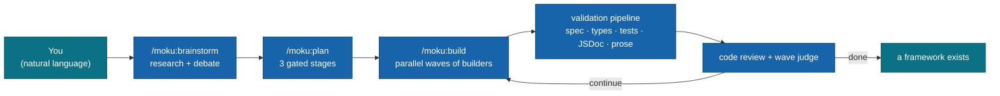

<div align="center">

# moku — Claude Code Plugin

*The development toolkit for [Moku Core](https://github.com/moku-labs/core).*

In which one AI orchestrates twenty other AIs to double-check the code a twenty-first AI wrote.

</div>

<div align="center">

[](./CHANGELOG.md)
[](https://code.claude.com/docs/en/plugins)
[](https://github.com/moku-labs/core)
[](./CHANGELOG.md)
[](./LICENSE)

[Install](#install) · [Workflow](#the-workflow) · [Commands](#commands) · [Agents](#agents) · [Skills](#skills) · [Hooks](#hooks) · [Workflows](#dynamic-workflows) · [Config](#configuration)

</div>

---

## What this is

Commands, skills, validation agents, and hooks for building Moku frameworks, plugins, and consumer apps with full specification compliance — wave-based parallel builds, a 20-agent validation pipeline, TDD waves, lean execution mode (~40–60% context savings), and cross-session state in `.planning/`.

Yes, it ships a **wall-of-text validator**. No, the irony of its own `plugin.json` description — a 233-word run-on whose longest sentence clocks 142 words — is not lost on anyone.

## Install

```bash
/plugin marketplace add moku-labs/claude
/plugin install moku@moku
```

> [!IMPORTANT]
> The marketplace is named **`moku`** (see [`.claude-plugin/marketplace.json`](.claude-plugin/marketplace.json)), so it's `moku@moku`. A previous version of this README confidently documented two install commands that did not work. We've all grown.

Local development:

```bash
/plugin marketplace add ~/Projects/moku/claude
/plugin install moku@moku
```

**Requirements:** [Bun](https://bun.sh/) ≥ 1.3.14 · Node ≥ 22 · a project that uses [@moku-labs/core](https://github.com/moku-labs/core) (or the intention to create one).

## The workflow

You describe, it plans, an agent swarm builds, another swarm judges the first swarm, you press Enter occasionally.



Or skip the ceremony — `/moku:next` figures out where you are and does the next sensible thing.

```text
1. /moku:init my-framework                           # scaffold
2. /moku:brainstorm "a static site generator"        # optional: research + debate first
3. /moku:plan create framework "a static site generator"
4. /moku:build                                       # no args = auto-resume; waves + validation
5. /moku:check                                       # health check (graph for mermaid diagrams)
6. /moku:clean                                       # distill learnings, reset .planning/ for the next cycle
```

## Commands

Nine of them — two of which the old README forgot it had. All take free-form natural language; the bracketed syntax is for people who enjoy bracketed syntax.

| Command | What it does |
|---|---|
| `/moku:next [--dry-run]` | Auto-detect project state, run the next logical step |
| `/moku:init [path]` | Scaffold a Moku dev environment with full tooling |
| `/moku:brainstorm {idea} [--deep [N]\|--quick]` | Collaborative discovery: parallel research agents + a Present → Challenge → Decide debate loop. Also takes structured `create\|modify\|migrate\|feature` forms. Produces context files for planning |
| `/moku:plan [create\|update\|add\|migrate\|resume] [type] {req} [--quick] [--context {file}]` | Plan a framework / app / plugin — 3-stage gated workflow. `--context` consumes brainstorm output |
| `/moku:build [framework\|app\|plugin\|add\|resume\|fix] [name] [--dry-run\|--continue\|--lean]` | Build from specs in parallel waves. No args = auto-resume. `plugin #3`, `plugin #3-#5` work too |
| `/moku:check [verbose\|self-test\|graph\|status\|plugin <name>\|diff <name>]` | Diagnostics: project state, tooling, plugin health, mermaid graphs, plugin self-test |
| `/moku:status [--full]` | Consolidated dashboard — phase, wave progress, agent activity |
| `/moku:upgrade [--dry-run]` | Migrate a Moku project to the current target stack (TypeScript 6 baseline). No version args, gated, resumable |
| `/moku:clean [--keep …] [--no-summary] [--dry-run] [--force]` | Distill a durable cycle summary into `history.md`, then sweep ephemeral `.planning/` artifacts |

## Agents

Twenty subagents, summoned on demand. Grouped by what they judge:

| Group | Agents |
|---|---|
| **Structure** | `moku-spec-validator` · `moku-plugin-spec-validator` · `moku-jsdoc-validator` · `moku-web-validator` |
| **Quality** | `moku-plan-checker` · `moku-verifier` (3-level: exists → substantive → wired) · `moku-test-validator` · `moku-type-validator` · `moku-architecture-validator` · `moku-readable-code-validator` (the wall-of-text police; warnings only, never blocks) |
| **Review & judgment** | `moku-code-reviewer` · `moku-wave-judge` (continue / stop-for-review / fresh-retry) · `moku-error-diagnostician` · `moku-skeptic` |
| **Builders & research** | `moku-builder` · `moku-researcher` (the only agent with web access) · `brainstorm-researcher` · `brainstorm-challenger` · `brainstorm-synthesizer` |
| **Orchestration** | `moku-validation-coordinator` |

After a full framework build, the coordinator runs spec, plugin-spec, JSDoc, and readable-code validators in parallel; then tests + types in parallel alongside a speculative cross-plugin architecture pass (re-run only if cross-plugin blockers surface). The wave judge decides whether you (the human) need to be involved. Usually not.

## Skills

Auto-loaded context — they trigger when relevant topics come up, no invocation needed.

| Skill | Teaches Claude about |
|---|---|
| `moku-core` | Architecture rules, factory chain, lifecycle, events, context tiers |
| `moku-plugin` | Plugin structure spec, complexity tiers (Nano → VeryComplex), file layout, wiring harness |
| `moku-web` | `@moku-labs/web` patterns: Preact, CSS `@scope`/`@layer`/tokens, islands, Vite-free bundling — synced against the framework source (the upstream docs lag; `src/` is treated as authoritative) |
| `moku-testing` | TDD protocol for build waves, mock context factories, integration + type-level test patterns, test layout |
| `moku-readable-code` | The story-by-layout stanza style — prose structure for code, checked by its validator |
| `moku-sync` | Maintainer skill: re-syncs each framework's knowledge from its latest npm/GitHub release |
| `spec-sync` | Maintainer skill: re-vendors the Moku Core spec + sandbox exemplars at a pinned SHA, then chains `moku-sync` across the family |

## Hooks

21 scripts on 12 lifecycle events. A short tour rather than a wall:

| When | What happens |
|---|---|
| **Session start / end** | Detects project type + planning state, validates Bun/Node/tsc versions, reports core version; cleans up on exit |
| **Every prompt** | Injects compact project context (type, plugins, planning phase) |
| **Before writes** | Auto-approves known `.planning/` writes; blocks plugin anti-patterns (`createPlugin<` generics, `as any`, wire factories, inline casts); validates plugin structure & `index.ts`; during an active brainstorm, blocks writes outside `.planning/` |
| **Around commits** | `git commit` mid-wave runs tsc + lint first and blocks on failure; commits touching `.planning/` are always rejected; after a commit lands, a lightweight self-review scans the diff |
| **After writes** | Biome-formats the changed file (async, if the project has a format script) |
| **Around compaction** | Re-injects `.planning/STATE.md` + decisions + research + memory, so context loss isn't knowledge loss |
| **Agent + tool events** | Logs moku agent completions and tool failures; desktop notifications with sound when input is needed; auto-permissions; refuses to stop mid-wave, chimes when genuinely done |

Full wiring: [`hooks/hooks.json`](hooks/hooks.json). There's also a custom status line (phase / wave / context / rate-limit) — opt-in via `/statusline` — because a 40-minute build deserves a *ding*.

## Dynamic workflows

Three opt-in [dynamic workflow](https://code.claude.com/docs/en/workflows) scripts (research preview, Claude Code ≥ 2.1.154) for the fan-out-heavy phases — parallel orchestration instead of turn-by-turn:

| Workflow | Does |
|---|---|
| `/moku-verify` | The full validation pipeline as one parallel fan-out — adversarial skeptics on by default — then an aggregated report |
| `/moku-build-wave` | One wave end-to-end without stopping: each plugin verified the moment its builder finishes, then a wave-judge disposition |
| `/moku-migrate-sweep` | Parallel migration sweep across a repo — one agent per file, disjoint writes |

Caveats (no mid-run gates, agents inherit your allowlist) in [`workflows/README.md`](workflows/README.md). The interactive gated commands stay turn-by-turn on purpose.

## Output styles

Two moods, matched to the phase:

- **`moku-planning`** — verbose, analytical: trade-offs, comparisons, full reasoning.
- **`moku-building`** — terse, progress-focused: status lines, pass/fail counts, minimal prose. (The style this README aspires to.)

## Configuration

Per-project overrides live in `.claude/moku.local.md`:

```markdown
---
maxParallelAgents: 3
gapClosureMaxRounds: 2
---

Project-specific notes and context here.
```

Supported fields: [`skills/moku-core/references/plugin-settings.md`](skills/moku-core/references/plugin-settings.md).

**State** lives in `.planning/STATE.md` — phases, plugin status, wave progress. It's what makes `resume` work and survives context compaction (via the PreCompact hook). The whole `.planning/` directory is always gitignored, and a hook rejects any commit that touches it.

## License

[MIT](./LICENSE) © [moku-labs](https://github.com/moku-labs) — built by [Oleksandr Kucherenko](https://github.com/AlexTiTanium), reviewed by twenty agents who report to him.
