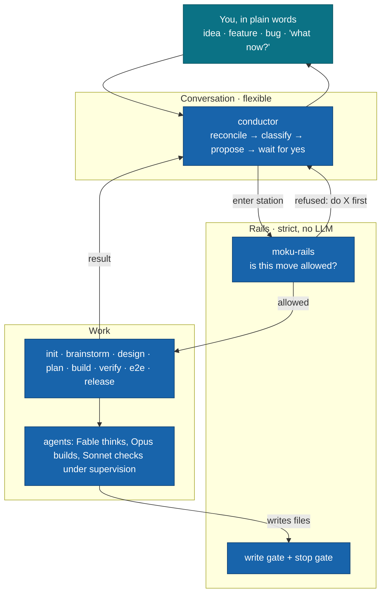

<div align="center">

# moku — Claude Code plugins

*The development toolkit for [Moku Core](https://github.com/moku-labs/core).*

You describe an idea. It leads you by the hand, and refuses to let you skip the important parts.

</div>

<div align="center">

[](./CHANGELOG.md)
[](https://code.claude.com/docs/en/plugins)
[](https://github.com/moku-labs/core)
[](./plugins/moku/tests)
[](./LICENSE)

[Install](#install) · [How it works](#how-it-works) · [Plugins](#plugins) · [The rails](#the-rails) · [Models](#models) · [Astra](#astra) · [Releases](#releases) · [Develop](#develop)

</div>

---

## What this is

A core plugin and one pack per Moku framework. Together they take a project from "I have an idea" to a
released package or a deployed app, and keep leading after that: every later feature, fix and tweak
travels the same lifecycle.

You never need to know a command. You talk; the **conductor** works out where the project stands,
proposes the next step and runs it. Underneath, the **rails** make the critical steps impossible to
skip: no code before the project is initialized, no plugin without a plan, no "done" with red tests.

## Install

```bash
/plugin marketplace add moku-labs/claude
/plugin install moku@moku
```

Then add the packs for the frameworks you use:

```bash
/plugin install moku-web@moku
/plugin install moku-design@moku
```

**Requirements:** [Bun](https://bun.sh/) ≥ 1.3.14 · Node ≥ 24 · Claude Code ≥ 2.1.277. The optional
Astra integration needs the [Codex CLI](https://github.com/openai/codex), logged in.

## How it works


```mermaid
flowchart TB
  U["You, in plain words<br/>idea · feature · bug · 'what now?'"]
  subgraph L1["Conversation · flexible"]
    C["conductor<br/>reconcile → classify → propose → wait for yes"]
  end
  subgraph L2["Rails · strict, no LLM"]
    R["moku-rails<br/>is this move allowed?"]
    H["write gate + stop gate"]
  end
  subgraph L3["Work"]
    S["init · brainstorm · design · plan · build · verify · e2e · release"]
    A["agents: Fable thinks, Opus builds, Sonnet checks under supervision"]
  end
  U --> C
  C -->|enter station| R
  R -->|allowed| S
  R -->|refused: do X first| C
  S --> A
  A -->|writes files| H
  S -->|result| C
  C --> U
  classDef u fill:#0b7285,stroke:#08525f,color:#fff;
  classDef m fill:#1864ab,stroke:#0d3d6e,color:#fff;
  class U u
  class C,R,H,S,A m
```

After a project exists, everything you bring becomes a **change** with a size, and the size picks the route:

| Size | Sign | Route |
|---|---|---|
| S | one plugin, public API unchanged | intake → build → verify → close |
| M | new plugin, or an API changes | intake → plan (delta spec) → build → verify → e2e → release → close |
| L | several plugins, a new framework, an architecture shift | intake → brainstorm → design → plan → build → verify → e2e → release → close |

Brainstorm, design, e2e and release are optional. Plan, build, verify and the closing checklist
(tests green, verify passed, docs current) are not.

## Plugins

| Plugin | Holds |
|---|---|
| [`moku`](./plugins/moku) | The conductor, the lifecycle skills, the vendored Moku Core spec, core agents, the rails and hooks, the release skill |
| [`moku-web`](./plugins/moku-web) | `@moku-labs/web` knowledge, the web validator, real-browser e2e with exploratory QA and a UX gate |
| [`moku-design`](./plugins/moku-design) | The design station in three modes (UI, API, architecture) and GPT-6 Astra as artist and second opinion on UX |
| [`moku-worker`](./plugins/moku-worker) | `@moku-labs/worker`: the Cloudflare Workers backend framework |
| [`moku-room`](./plugins/moku-room) | `@moku-labs/room`: couch multiplayer |
| [`moku-native`](./plugins/moku-native) | `@moku-labs/native`: packages a Moku app as a Tauri 2 desktop or mobile app |
| [`moku-system`](./plugins/moku-system) | `@moku-labs/system`: store, notify, clipboard, tray and deep-link in the browser and in a Tauri shell |
| [`moku-common`](./plugins/moku-common) | `@moku-labs/common`: `logPlugin`, `envPlugin`, env providers per runtime and the branded CLI kit |
| [`moku-maintainer`](./plugins/moku-maintainer) | Re-vendors the spec and syncs framework knowledge. For this repository only, disabled by default |

A new framework gets a pack from [`docs/pack-template`](./docs/pack-template) without touching the
core. Packs depend on the core; the core never names a pack.

Every skill is still reachable directly for people who like commands: `/moku:build`,
`/moku:verify`, `/moku-design:design`, `/moku-web:e2e` and so on. They travel the same rails.

## The rails

`moku-rails` is a small tested CLI ([`plugins/moku/lib/rails`](./plugins/moku/lib/rails)). Exit code 2
means "refused", and the refusal names the missing step, so the conductor can offer it.

The rails act in one kind of directory only: one where a moku session was started. The `moku:session`
skill settles the directory (this one, or a new folder) and runs `moku-rails session start`, which writes the
ledger. Every other project is left alone, whatever its `package.json` names: no gate, no hint, no hook output.

| Invariant | Enforced by | What you see |
|---|---|---|
| Hooks act only where a session was started | every hook resolves its project from `.planning/state.json` or `.planning/moku.md`, found from the file being written | nothing, in your other projects |
| Every request is routed before code follows it | prompt hook (`UserPromptSubmit`) marks the request unrouted; the write gate waits for `open`, `enter`, `continue` or `scope` | the conductor answers first, also in the middle of a build |
| New scope goes back to plan | `moku-rails scope` | "That is new. Let me add it to the plan first" |
| Optional stations are skipped on your word only | `moku-rails enter plan|build|close` refuses while design, e2e or another optional station is neither done nor skipped | "Shall I draw it first, or skip the design?" |
| No source files before init | write gate (`PreToolUse`) | "Let me create the project first, it takes a minute" |
| No plugin code without a plan or an open change | write gate + `moku-rails enter build` | "I'll write down what we're building first" |
| Stations only in a legal order | `moku-rails enter <station>` at the top of every lifecycle skill | the conductor proposes the missing step |
| No walking away mid-build | stop gate (`Stop`), unless paused for you | an honest "here is what is left" |
| The ledger matches reality | `moku-rails status` at session start: open changes, stray uncommitted work | "We left the streak fix unfinished. Finish it first?" |

The ledger is `.planning/state.json`. `.planning/` is local state and is never committed.
Set the `rails` option of the plugin to `warn` or `off` if you need to step outside.

## Models

| Role | Model | Effort |
|---|---|---|
| Conductor, gates, judging, synthesis; plan, brainstorm and design at `high` | Fable | medium |
| Plan checker, challenger, architecture validator | Fable | high |
| Builder, fixer, code reviewer, e2e tester, QA explorer, design generator | Opus | high (`xhigh` for Complex plugins and after a failed attempt) |
| Skeptic: supervises the findings of smaller models | Opus | medium |
| Structure, style, quality and web validators, researcher, UX executor | Sonnet | medium |
| "Does it exist, is it real, is it wired" | a script | none |

A smaller model never closes a gate: its findings pass the skeptic, and the final call is Fable's.

## Astra

With `moku-design` and the Codex CLI, GPT-6 Astra joins as the artist for image assets and as a second,
independent opinion on user experience, at two gates: after a design round and after functional e2e
is green. She advises; Fable triages every finding and writes down each rejection with its reason.
She never reviews code. When she is unavailable for any reason, Fable reviews alone and the gate
still runs.

## Releases

Every moku package releases the same way: `bun run release:setup` once, `bun run release:doctor` any
time, `bun run release patch` for every release. Two thin workflow files call the shared workflows in
[`moku-labs/ci`](https://github.com/moku-labs/ci). No tokens; the only manual steps are `npm login`
and `gh auth login`. See the [`moku-release`](./plugins/moku/skills/moku-release/SKILL.md) skill.

## Develop

```bash
npm test          # node:test suites for the rails, the hooks, the verifier script, the Astra wrapper
npm run validate  # claude plugin validate for the marketplace and every plugin
npm run evals     # behavior evals of the core plugin (costs model usage)
```

[`docs/revival/DECISIONS.md`](./docs/revival/DECISIONS.md) records what changed in 0.70 and why.
Eval cases live in each plugin's `evals/`; the 0.62.4 baseline is in
[`plugins/moku/evals/baselines`](./plugins/moku/evals/baselines).

## License

[MIT](./LICENSE) © [moku-labs](https://github.com/moku-labs) — built by [Oleksandr Kucherenko](https://github.com/AlexTiTanium).
