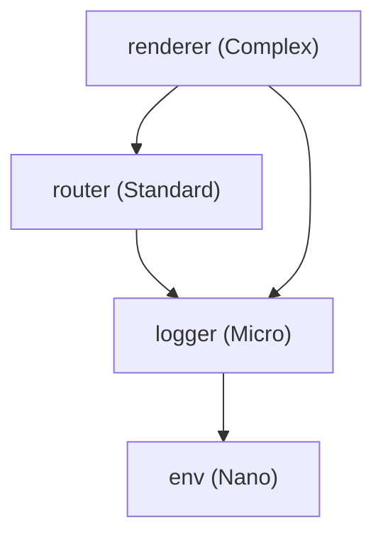
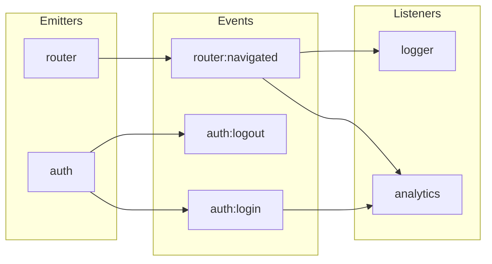

Run a diagnostic check on the current Moku project and plugin installation. Reports issues with project structure, planning state, and plugin health.

## Checks

### 1. Project Detection

Detect the project type:
- Check for `src/config.ts` with `createCoreConfig` → Framework (Layer 2)
- Check for `createApp` import from a framework package → Consumer App (Layer 3)
- Check for `package.json` → Generic project
- Report: project type, framework name (if applicable)

### 2. Tooling Verification

Check that required tooling is configured:
- `package.json` exists with expected scripts (`build`, `lint`, `format`, `test`)
- `biome.json` exists
- `tsconfig.json` exists with strict mode
- `vitest.config.ts` exists
- `.gitignore` includes `.planning/`, `dist/`, `node_modules/`
- Report: PASS/MISSING for each

### 3. Planning State

Check `.planning/STATE.md`:
- If exists: report current phase, completed stages, next action
- If not: report "No active plan"
- Check for stale state (last updated > 7 days ago)
- Check `.planning/specs/` directory for spec files

### 4. Plugin Health (Framework projects)

For each plugin in `src/plugins/`:
- Check file count matches expected tier
- Check `index.ts` exists and is < 50 lines
- Check `README.md` exists
- Check `__tests__/` directory exists
- Report: plugin name, tier assessment, health status

### 5. Build Status

Run quick checks (skip if no package.json):
- `bunx tsc --noEmit` — type check
- `bun run lint` — lint check
- Report: PASS/FAIL for each

### 6. Dependency Check

- Check `@moku-labs/core` version (if framework project)
- Check for outdated dependencies
- Report any peer dependency warnings

## Output

Present a summary table:

```
Moku Project Diagnostic Report
===============================
Project type: Framework (Layer 2)
Framework: my-framework

Tooling:       [PASS] All config files present
Planning:      [ACTIVE] Phase: stage2/approved (3 specs created)
Plugins:       [OK] 5 plugins (2 Nano, 1 Micro, 2 Standard)
TypeScript:    [PASS] tsc --noEmit clean
Lint:          [PASS] Zero warnings
Dependencies:  [OK] @moku-labs/core@1.0.0

Issues:
- WARNING: Plugin "cache" has no __tests__/ directory
- INFO: .planning/STATE.md last updated 3 days ago
```

If `$ARGUMENTS` contains "verbose", show full details for each check. Otherwise show the summary only.

If `$ARGUMENTS` contains "graph", generate mermaid diagrams for the project (Framework projects only):

### Dependency Graph
Build a mermaid flowchart from all plugin `depends: [...]` declarations:

- Each node shows plugin name and tier
- Arrows flow from dependent → dependency
- Color-code by tier: Nano=green, Micro=blue, Standard=orange, Complex=red, VeryComplex=purple

### Event Flow Map
Build a mermaid flowchart showing event declarations, emitters, and listeners:

- Left: plugins that emit, Center: event names, Right: plugins that hook
- Orphan events (no listeners) shown in dashed style
- Dead hooks (no emitter) shown in red

### Wave Execution Plan
If `.planning/STATE.md` has wave grouping, generate a Gantt-style diagram:

```mermaid
gantt
  title Build Wave Execution
  dateFormat X
  axisFormat %s
  section Wave 1
    env     :0, 1
    logger  :0, 1
  section Wave 2
    router  :1, 2
    auth    :1, 2
  section Wave 3
    renderer :2, 3
```


Output all three diagrams with brief descriptions. If the project has no plugins yet, report "No plugins found — nothing to graph."

If `$ARGUMENTS` contains "self-test", skip project checks and instead validate the Moku Claude plugin itself:
1. Verify all agent `.md` files exist in `${CLAUDE_PLUGIN_ROOT}/agents/` and have valid YAML frontmatter (name, description, model, tools). Count them dynamically — do not hardcode an expected number.
2. Verify all skill directories exist with SKILL.md files in `${CLAUDE_PLUGIN_ROOT}/skills/`
3. Verify `${CLAUDE_PLUGIN_ROOT}/hooks/hooks.json` parses as valid JSON
4. Verify all referenced hook scripts exist and are executable
5. Verify all reference files mentioned in skills/commands exist
6. Verify `${CLAUDE_PLUGIN_ROOT}/.claude-plugin/plugin.json` parses correctly
7. Verify version in `plugin.json` matches version in `marketplace.json` (prevents version drift regression)
8. Report PASS/FAIL for each check

If `$ARGUMENTS` contains "status", show a compact overview of all plugins and their current state (Framework projects only):

1. List all plugins in `src/plugins/` with:
   - Plugin name
   - Assessed complexity tier (based on file count and structure)
   - File count
   - Whether `__tests__/` exists
   - Whether `README.md` exists
   - Build status from `.planning/STATE.md` (if it exists)
2. Show total plugin count and tier distribution
3. Show planning state summary (if active)

Example output:
```
Moku Plugin Status
==================
| Plugin   | Tier     | Files | Tests | README | Build   |
|----------|----------|-------|-------|--------|---------|
| env      | Nano     | 3     | Yes   | Yes    | done    |
| logger   | Micro    | 3     | Yes   | Yes    | done    |
| router   | Standard | 8     | Yes   | Yes    | done    |
| renderer | Complex  | 12    | Yes   | Yes    | pending |

Total: 4 plugins (1 Nano, 1 Micro, 1 Standard, 1 Complex)
Plan: stage2/approved — Next: /moku:build #4
```

If `$ARGUMENTS` contains "plugin" followed by a plugin name, run targeted validation on that single plugin:

1. Verify the plugin directory exists in `src/plugins/<name>/`
2. Assess its complexity tier from file structure
3. Run fast checks first: `bun run format`, `bun run lint`, `bunx tsc --noEmit`, `bun run test`
4. If all fast checks pass, report PASS and skip agent-based validation (unless `--full` flag is also present)
5. If fast checks fail OR `--full` is present, spawn 3 validators in parallel:
   - **moku-plugin-spec-validator** — tier compliance, file organization, index.ts quality
   - **moku-type-validator** — tsc --noEmit, import type compliance, no `as any`
   - **moku-jsdoc-validator** — JSDoc completeness on all exports
6. Report results with PASS/WARN/FAIL for each validator
7. If any BLOCKER issues found, list them with fix suggestions

If `$ARGUMENTS` contains "diff" followed by a plugin name, compare the spec against the implementation:

1. Find the spec file in `.planning/specs/*-<name>.md`
2. Read the spec's Config, State, API, Events, Dependencies, and Hooks sections
3. Read the built plugin files (`types.ts`, `api.ts`, `state.ts`, `index.ts`)
4. Compare each spec section against the implementation:

```
Spec-vs-Implementation Diff: [plugin-name]
============================================
| Section      | Spec                    | Implementation          | Status |
|--------------|-------------------------|-------------------------|--------|
| Config       | basePath, trailingSlash | basePath, trailingSlash | MATCH  |
| State        | currentPath, routes     | currentPath, routes, history | EXTRA: history |
| API          | navigate, current, back | navigate, current       | GAP: back |
| Events       | router:navigated        | router:navigated        | MATCH  |
| Dependencies | env                     | env                     | MATCH  |
| Hooks        | app:started             | app:started             | MATCH  |
```

5. Report MATCH (spec matches implementation), GAP (spec has item, implementation missing), EXTRA (implementation has item not in spec)
6. GAP items are flagged as BLOCKER — the spec promised this API/feature
7. EXTRA items are flagged as INFO — implementation added beyond spec (may need spec update)
