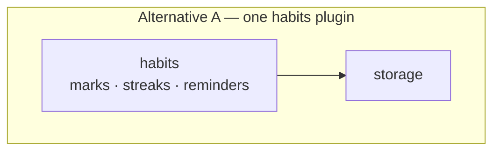
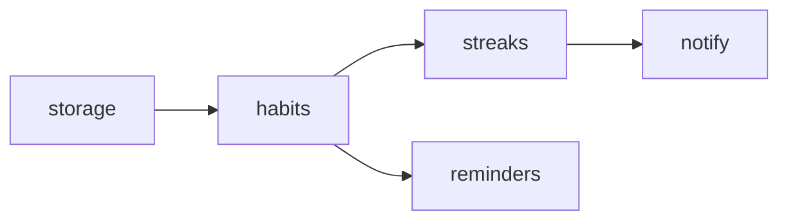
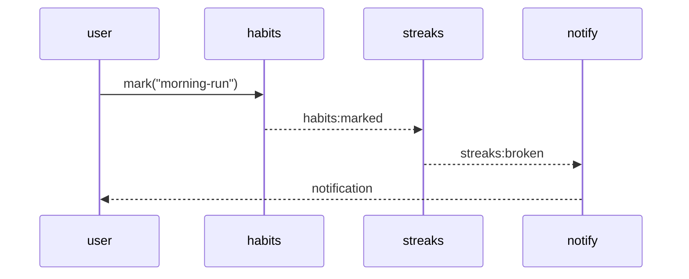

# Design mode — `architecture`

Deciding where the plugin boundaries fall, what depends on what, and which events flow between them —
before any of it is built. The output is the architecture section of `design-context.md`: a
specification the plan station turns into specs and waves.

Diagrams first. A boundary argument in prose is hard to compare; two graphs side by side are not.

```
2-3 decompositions ──> boundary + dependency + event diagrams each ──> comparison table ──> pick ──> capture
```

## Before you start

Load the `moku:moku-core` skill with the Skill tool and read the reference it points to: the three-layer
model, the factory chain, `ctx` tiers, the event system and plugin structure. An alternative that breaks a
layer boundary is not an alternative.

## Step 1 — Two or three decompositions

Each one is a different answer to the same question: which concerns are their own plugin, and which are
folded into a neighbour. Give each a short name so the user can talk about it.

For each, three diagrams.

**Boundaries** — what each plugin owns.



**Dependency graph** — who imports and requires whom. It has to be acyclic; say so if a proposal is not.



**Event flow** — who emits, who listens, with the event names as they will exist.



## Step 2 — Compare on named axes

| Axis | What it measures |
|---|---|
| Boundary clarity | Whether each plugin has one concern you can name in a phrase |
| Coupling | Number of dependency edges, and whether any are circular |
| Event surface | How many events cross boundaries, and whether any is a disguised function call |
| Testability | Whether a plugin can be tested with a mock `ctx` and no neighbours |
| Change cost | What a likely future change touches — one plugin or several |
| Spec consistency | Layer separation, factory chain, `ctx` tiers, event naming |

One row per alternative. Use counts where a count exists — edges, events, plugins — and say "unknown
without measuring" rather than guessing.

| | Boundaries | Coupling | Events | Testability | Change cost | Spec |
|---|---|---|---|---|---|---|
| A | 2 plugins, habits does three things | 1 edge, acyclic | 1 crossing event | habits needs storage mocked | reminder change touches habits | Fits |
| B | 4 plugins, one concern each | 4 edges, acyclic | 3 crossing events | each testable alone | reminder change is local | Fits |

Say which you would pick and why in two sentences before asking.

## Step 3 — The pick

`moku-rails pause --reason "architecture pick"`, then `AskUserQuestion` with one option per alternative
plus a mix. Record what was chosen and, for a mix, which parts came from which alternative.

## Step 4 — Capture

Write into `design-context.md`: the chosen decomposition's three diagrams, the plugin list with the one
concern each owns, the event table (name, emitter, listeners, payload shape in words), the axes table with
the decision, and the rejected alternatives with their reasons.

It is a specification. The diagrams say which plugins exist and how they talk; the plan station turns them
into plugin specs and build waves, and the builder writes the code from scratch with all the project's
conventions.
