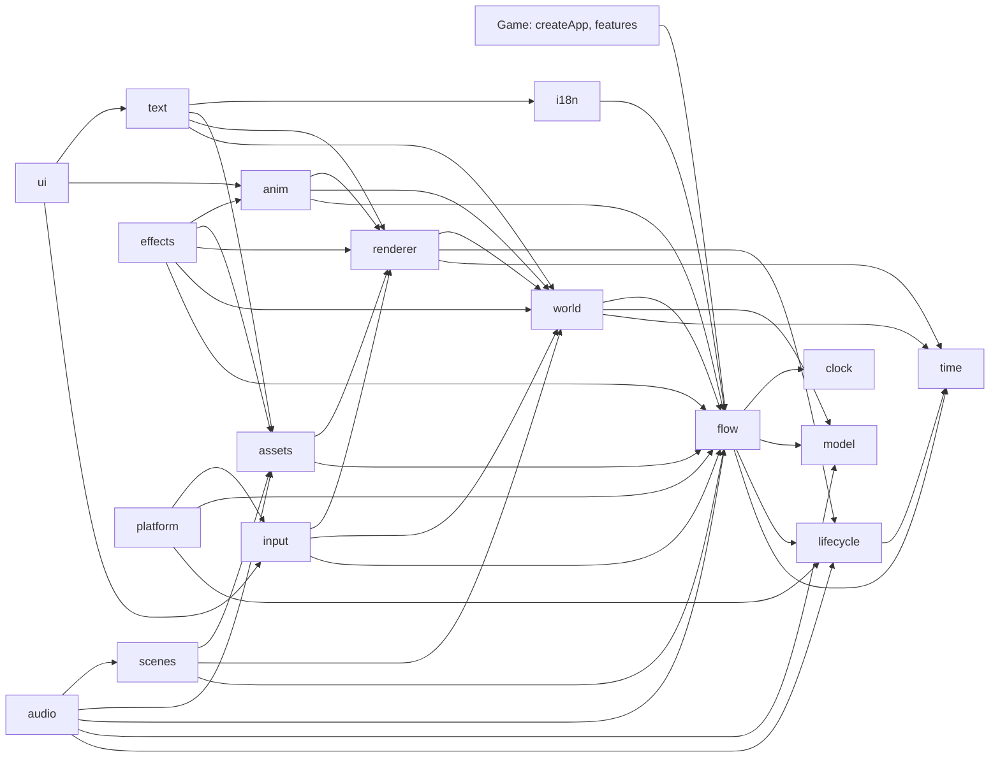

# @moku-labs/game — Plugin & Property Index

**Synced version:** `0.4.6` (catalog from the `v0.4.4` tag: `llms.txt`, `docs/plugins.md`, `docs/events.md`,
`docs/configuration.md`, `docs/doors.md`, `docs/jsx.md`, `src/plugins/*/README.md`, plus the `v0.4.6`
`llms.txt` section "Lint for games"). 0.4.6 adds the entry `@moku-labs/game/lint`; 0.4.5 and 0.4.6
change no runtime API. 0.4.4 adds the
`game.mute` door for the editor's Sound switch: the command `game.mute`, the source `game.audioMuted` and
`audio.muted(bus)`. Since 0.4.3 `@moku-labs/core ^1.7.1` and
`@moku-labs/common ^0.3.4` are **peer** dependencies (Bun installs them on `bun add`). `pixi.js ^8.0.0` is a **peer** dependency; `playwright-core` and `sharp`
are optional peers. Engines node ≥24, bun ≥1.3.14. ESM only.

The second half indexes **`@moku-labs/editor@0.2.1`** (peer `@moku-labs/game >= 0.0.2`, works with game
0.1.x and 0.4.x).

> The package ships `llms.txt` since 0.4.0 (`node_modules/@moku-labs/game/llms.txt`). It matches the
> installed version.

**Breaking in 0.4.0** (pre-1.0): a literal `{ component, field }` text bind became `bind(Component, "field")`;
`game.capture` answers `{ png }`, not a string; `game.rect` became `game.locate`; `assets.audio(key)` answers
`{ bytes, mime }`; `runCli(argv, strings)` takes `{ compile, exportStrings, importStrings }`.

## Plugin sets

```ts
createApp({ plugins: [...screen, effectsPlugin, audioPlugin, platformPlugin, ...features] });
```

| Set | Plugins | How |
|---|---|---|
| logic | `time`, `lifecycle`, `model`, `clock`, `flow` | always registered, in this order |
| screen | `world`, `renderer`, `input`, `assets`, `scenes`, `anim`, `i18n`, `text`, `ui` | the exported list `screen` |
| opt-in | `effects`, `audio`, `platform` | append; `platform` last |

`log` and `env` from `@moku-labs/common` sit on every context as `ctx.log` and `ctx.env`. A feature name
is refused when it equals any plugin name above, or `log` / `env`.

## The 17 plugins

| Plugin | Tier | Depends on | Owns | App API (`app.<name>`) |
|---|---|---|---|---|
| `time` | Standard | — | One `requestAnimationFrame` loop, six phases `input, animate, layout, sync, signals, render`, the `Time` resource `{ delta, elapsed, scale, frame, idle }`. Idle cap after `idleAfterMs` | `onFrame(phase, cb): () => void`, `snapshot()`, `setScale(scale)`, `pause()`, `resume()`, `isPaused()`, `isRunning()`, `step(deltaMs)`, `wake()` |
| `lifecycle` | Standard | time | The stack of pause reasons: `"background"`, `"devtools"`, `"system-dialog"`, `"device-lost"`, any string | `push(reason)`, `pop(reason)`, `reasons()`, `isPaused()` |
| `model` | Very Complex | — | The `session` tree and the save document `{ player, rng }`; transactions, rest-point rollback, rng streams, migrations | `store.load()`, `store.snapshot()` (frozen `{ player, session, rng }`), `store.begin()`, `store.markRest()`, `store.markBarrier(txId)`, `store.rollback()`, `store.restore(input)`, `store.flush()`, `rng.peek(id)` |
| `clock` | Standard | — | Trusted time: monotonic `now()`, one `elapsed` signal at the next due moment | `now()`, `scheduleAt(moment \| undefined)`, `onElapsed(listener)`, `poke()`, `dueAt()` |
| `flow` | Very Complex | time, lifecycle, model, clock | The graph: runner, gate, inbox, effects gateway, features registry | `run()`, `onEnter("load" \| "scene", cb)`, `walk(route, { from? })`, `bookmark()`, `restore(bookmark)`, `describe()`, `state()`, `history()`, `setMode("live" \| "fast")`; `gate.answer({ intent, payload? }): boolean`, `gate.pointer(active)`, `gate.state()`; `inbox.post({ type, payload? })`; `fx.handle(kind, handler, { runInFast? })`, `fx.dispatch(descriptor)`; `features.register(name, description)`, `features.all()`, `features.contributions(slot)` |
| `world` | Very Complex | time, model, flow | A zero-dependency ECS and the projection from committed state to entities: keyed reconcile of one `view(item)`, retarget motions, despawn queue, named layers | `ecs.spawn(owner, components)`, `ecs.query(...C)`, `ecs.system(def)`, `ecs.set(entity, C, patch)`, `ecs.changed(C)`, `ecs.snapshot()`, `ecs.mode()`; `projection.mount(names, owner)`, `projection.setLayers(list)`, `projection.settle(entity)`, `projection.keyOf(entity)`, `projection.entityOf(projection, key)` |
| `renderer` | Very Complex | time, lifecycle, world | Pixi v8 host loaded lazily, one `sync` system that owns every display object, the reference viewport, frame stats | `host.ready()`, `host.kind()`, `host.canvas()`, `host.pixi()`, `host.device()`, `host.gl()`; `sync.hitTest(x, y, accept)`, `sync.hitAll(x, y)`, `sync.boundsOf(entity)`, `sync.hitBoxOf(entity)`, `sync.textures.provide(fn)`, `sync.fonts.install(key, fnt, texture)`, `sync.filters.set(entity, slots)`, `sync.displayOf(entity)`, `sync.debug.nineSlice(on)`; `viewport.toReference(x, y)`, `viewport.toScreen({ x, y })`, `viewport.size()`; `stats()`, `capture(options?)` (dev only, `{ png, legend? }`; options `legend`, `layers`, `sheet`, `against`) |
| `input` | Standard | flow, world, renderer | Gestures as data components `Tappable`, `Pressable`, `Draggable` (`{ payload, carry }`: `carry` lists keys of the same projection that ride along, a solitaire stack), `DropTarget`, `Swipeable`, `Traceable` (a word-game path of cells), `Touchable`, `Held`, `Hovered`, `PointerOver`, `Pressed`, `Traced` (on every cell of the trace in progress), `Pointer`; the intent reaches `flow.gate`. A trace answers once on release: `{ intent, payload: { path: [payload, …] } }` | `tap(target)`, `press(target)`, `drag(from, to)`, `swipe(target, direction)`, `trace(path)`, `pressKey(key, { shift })` |
| `assets` | Complex | flow, renderer | Manifest, five tiers, graph-driven preload, texture budget with LRU unload, typed keys from the `./assets` door | `load(bundle)`, `unload(bundle)`, `isLoaded(bundle)`, `texture(key)`, `font(key)`, `audio(key)` (`{ bytes, mime }` since 0.4.0), `usage()` |
| `scenes` | Standard | flow, world, assets | A scene as a declaration: bundle, layers, projections, `music`. A node names its scene; the switch runs in `flow.onEnter("scene")` | `current()` |
| `anim` | Complex | flow, world, renderer | The one tween core, timelines as frozen data from typed slots, `defineMotion` for enter/exit/change, the `Frames` component | `play(animation, slots)`, `finishAll()`, `active()`, `onMark(fn)`, `setReducedMotion(on)`, `reducedMotion()` |
| `i18n` | Complex | flow | Strings as data: `tr(key, params)` is a `Message`; ICU MessageFormat compiled by `compileStrings`; `Part[]` at run time | `locale()`, `setLocale(locale)` (async), `format(message, locale?)`, `plain(message)`, `has(key)`, `duration(ms, style?)`, `locales()`. ICU `{x, duration, short}`; a string may be `{ "text", "note" }` for translators; pseudo-locale `en-XA` |
| `text` | Complex | time, flow, world, renderer, assets, i18n | The `Text` component, `label()`, `defineTextStyles()`, tags `<b> <i> <color=#hex> <icon=key>`, measurement from the font's advance table, BitmapText from MSDF fonts; `bind(Component, "field", { format? })` shows a numeric component field (`int`, `mm:ss`, `h:mm:ss`, `duration`); `Countdown({ until })` counts down to a `clock` moment | `measure(content, style)`, `hasGlyph(char, style)`, `styles()` |
| `ui` | Very Complex | input, anim, text | A screen is a projection whose `view` returns JSX; reconciled by identity into entities, one Yoga solve per change; `defineComponent` with `local` and `outcomes`, `popup` as an effect, `defineStyle`, `defineTokens`; the `input` tag is a text field; `scroll` has a windowed form `rows`, `rowHeight`, `overscan` (5), `row`; plays `change` hooks of any component in `motion` | `tree()`, `find(key)`, `lint()`, `fill(key, value)` |
| `audio` | Standard | lifecycle, model, flow, assets, scenes | Opt-in. Buses `master`, `music`, `sfx`; `sfx()` and `music()` descriptors; the scene's `music`; volumes from the committed player; music `"decode"` (gapless buffer) or `"stream"` (`<audio>` element, about 12 MB instead of 58 MB); the iOS audio session (`"ambient"` by default) | `setVolume(bus, value)`, `volume(bus)`, `mute(bus, on)`, `muted(bus)` (since 0.4.4), `unlocked()`, `journal()` |
| `effects` | Complex | flow, world, renderer, assets, anim | Opt-in. Particles (`defineEmitter`, `Emitter`); filters (`defineFilter` with WGSL + GLSL twin; built-in `Glow`, `Outline`, `Blur`, `ColorMatrix`, `Noise`, `Displacement`, `Alpha`). Headless draws nothing | `stats()` |
| `platform` | Standard | lifecycle, flow, input | Opt-in, last. The phone as a `PlatformProvider`: pause/resume → `"background"`, Back chain (Escape, then intent `back`, then `exit()`), `haptic` effect, `keepAwake`. Inert without a provider | `back()` |

### Dependency graph



## Root exports

| Export | Kind | Purpose |
|---|---|---|
| `createApp`, `createPlugin` | functions | The game app; a game plugin bound to the engine's config and events |
| `defineGame<Types>()` | function | Returns the typed kit: `defineNode`, `defineFlow`, `defineFeature`, `projection`, `sprite`, `Sprite`, `NineSlice`, `defineBundles`, `load`, `defineScene`, `tr`, `label`, `defineTextStyles`, `defineComponent`, `defineStyle`, `defineTokens`, `popup`, `defineAnimation`, `frames`, `sfx`, `play`, `music`, `Frames`, `defineEmitter`, `Emitter`, `Displacement`. `Types = { player; session; assets: string; bundles?: string; scenes?: string; strings: Record<string, unknown>; textStyles?: string; emitters?: string }` |
| `defineFeature` | function | Untyped twin of the kit's. Keys: `nodes`, `flows`, `contribute`, `projections`, `systems`, `components`, `scenes`, `assets`, `animations`, `ui`, `strings`, `textStyles`, `emitters`, `filters` |
| `type`, `exit`, `to`, `slot` | functions | Payload type tag; the three edge helpers |
| `schedule`, `guide`, `hint` | functions | Effect descriptors: next due moment, tutorial narrowing of the gate, cosmetic hint |
| `SaveUnreadableError` | class | From `model.store.load()`: `savedVersion`, `schemaVersion` |
| `component`, `tag`, `resource`, `mut`, `system`, `projection`, `Layer`, `Order`, `Exiting`, `Tree` | ECS vocabulary | From `world` |
| `Transform`, `Sprite`, `NineSlice`, `Shape`, `Parent`, `Display`, `sprite` | components | From `renderer` |
| `Tappable`, `Pressable`, `Draggable`, `DropTarget`, `Swipeable`, `Traceable`, `Touchable`, `Held`, `Hovered`, `PointerOver`, `Pressed`, `Pointer`, `Traced` | components | From `input` |
| `defineBundles`, `load`, `defineScene` | functions | Bundles and scenes |
| `defineAnimation`, `sequence`, `parallel`, `stagger`, `tween`, `set`, `wait`, `mark`, `frames`, `sfx`, `haptic`, `use`, `spawn`, `spawned`, `play`, `external`, `defineMotion`, `Animation`, `Frames` | anim | Choreography as frozen data; `play(animation, slots)` is the effect a node awaits; `spawn` makes a temporary entity the timeline despawns |
| `tr` | function | `tr(key, params?)` → frozen `Message` |
| `Text`, `label`, `defineTextStyles`, `bind`, `Countdown`; types `BindOptions`, `CountdownValue`, `TextFormat` | text | Words on screen; `bind` and `Countdown` show numbers and timers |
| `defineComponent`, `popup`, `defineStyle`, `defineTokens`, `resolve`, `Box`, `LocalWrite` | ui | Components, the popup effect, the style vocabulary |
| `music` | function | `music(key \| null, { fadeMs? })` |
| `defineEmitter`, `Emitter`, `defineFilter`, `Glow`, `Outline`, `Blur`, `ColorMatrix`, `Noise`, `Displacement`, `Alpha` | effects | Particles and filters as data |
| `PlatformProvider`, `BackResult`, `HapticKind`, `HAPTIC_KINDS` | types, constant | The seam a game fills for `platform` |
| `timePlugin` … `platformPlugin`, `screen` | plugin instances | For `depends` and `ctx.require` |
| `Time`, `Lifecycle`, `Model`, `Clock`, `Flow`, `World`, `Renderer`, `Input`, `Assets`, `Scenes`, `Anim`, `I18n`, `TextTypes`, `Ui`, `Audio`, `Effects`, `Platform` | type namespaces | `import type { Flow } from "@moku-labs/game"` then `Flow.RouteStep`, `Flow.NodeContext`, `Model.Json`, `Model.PlayerStateProvider`, `Clock.ClockSource`, `Anim.Target`. `Text` is the component, so its types are `TextTypes` |

## Other entries

| Entry | Runs in | Exports |
|---|---|---|
| `@moku-labs/game/testing` | node, bun | `createHeadless`, `runRepro`, `stepFrames`, `fakeClock`, `memory`, `saveOf`, `defineVisualTest`, `runVisualTests`, `parseVisualArgv` |
| `@moku-labs/game/assets` | node, bun | `scanAssets`, `emitKeys`, `emitManifest`, `compileStrings`, `checkStrings`, `packAssets`, `exportStrings`, `importStrings`, `runCli(argv, { compile: compileStrings, exportStrings, importStrings })`. Flags: `--root <dir>` (default `.`), `--manifest <file>` (default `<root>/manifest.json`), `--keys <file>` (default `<root>/generated/assets.ts`), `--pack <dir>`, `--check`, `--no-cache`, `--pseudo` (en-XA), `--export <dir>`, `--import <dir>`, `--source <locale>` (default `en`). Audio `.mp3` or `.m4a`. Bin `moku-game-assets` (Bun shebang) |
| `@moku-labs/game/fonts/*` | files | `font-body.fnt`, `font-body.png` (Pangolin Regular MSDF, one 512×512 page), `LICENSE.txt` (SIL OFL 1.1). Copy into `features/ui/assets/` for the key `ui.font-body` |
| `@moku-labs/game/inspect` | anywhere | `read`, `watch`, `defineSource`, `sources`, types `Source`, `InputSchema`, `InputOf` |
| `@moku-labs/game/control` | dev builds | `run`, `defineCommand`, `controlRefused`, `commands`, types `Command`, `Ran` |
| `@moku-labs/game/jsx-runtime`, `/jsx-dev-runtime` | anywhere | What `"jsxImportSource": "@moku-labs/game"` resolves to |
| `@moku-labs/game/lint` | oxlint 1.86.0+ (`jsPlugins`) | Default export: the plugin `moku-game` with six rules. Since 0.4.6. See "Lint rules" below |

### Lint rules (`@moku-labs/game/lint`)

```json
{
  "jsPlugins": ["@moku-labs/game/lint"],
  "rules": {
    "moku-game/lazy-imports": "error",
    "moku-game/native-imports": "error",
    "moku-game/dev-imports": "error",
    "moku-game/no-module-state": "error",
    "moku-game/determinism": "error",
    "moku-game/rules-siblings": "error"
  }
}
```

| Rule | Engine rule | Reports | Default `files` |
|---|---|---|---|
| `lazy-imports` | L2 | Static value import of `pixi.js`, `yoga-layout`. `import type`, `import()` pass. `import { type A }` is reported | `**` |
| `native-imports` | L13 | `@moku-labs/system`, `@moku-labs/native`, `@tauri-apps/*` | the logic, `kit.ts`, `game.ts` |
| `dev-imports` | dev only | `@moku-labs/editor`, `@moku-labs/game/control` | all but `web/main.ts`, `web/dev*.ts`, `web/editor*.ts`, `*.dev.ts(x)` |
| `no-module-state` | L5 | Module-scope `let`, `var`, `new Map/Set/WeakMap/WeakSet` | `**` |
| `determinism` | L3 | `Math.random`, `Date.now`, `performance.now`, `new Date()`, `setTimeout`, `setInterval`. `new Date(now)` passes | the logic |
| `rules-siblings` | L4 | An import that is not a `./` sibling | `rules/**` |

- The logic = `**/state.ts`, `**/tables.ts`, `**/{nodes,flows,rules,features}/**`.
- Every rule skips `tests/**`, `**/__tests__/**`, `*.test.ts`.
- Options per rule: `["error", { "files": [...], "ignores": [...] }]`. Globs are relative to the
  directory oxlint runs in. A key given replaces the default.
- Types: `GameLintOptions`, `GameLintPlugin`, `GameLintRuleName` from `@moku-labs/game/lint`.

## Events

Global events are empty; every event belongs to a plugin. `time`, `clock`, `text`, `ui`, `audio`,
`effects`, `platform` emit nothing.

| Event | Emitted by | Payload | When |
|---|---|---|---|
| `lifecycle:changed` | `lifecycle` | `{ reason, action: "push" \| "pop", reasons, paused, resumed }` | The pause stack changed; `resumed` only on the change that emptied it |
| `model:committed` | `model` | `{ roots: ("player" \| "session" \| "rng")[], cause: "edge" \| "rollback" \| "restore" \| "load" }` | Committed state changed |
| `flow:edge` | `flow` | `{ flow, node, outcome, payload, next, patches: { doc, session }, index, now }` | After the commit of an edge |
| `flow:rest` | `flow` | `{ path, checkpoint }` | The graph entered a rest node |
| `flow:error` | `flow` | `{ path, error, rolledBackTo, retry }` | A node failed and the graph rolled back |
| `world:reconciled` | `world` | counts per reconcile | Dev only, behind `reconciledEvent` |
| `renderer:device-lost` | `renderer` | `{ kind, reason }` | GPU device or context lost; `lifecycle` pushed |
| `assets:bundle-loaded` | `assets` | `{ bundle, tier, mb, reason: "boot" \| "enter" \| "request" \| "preload" }` | A bundle entered memory |
| `assets:bundle-unloaded` | `assets` | `{ bundle, tier, mb, reason: "budget" \| "request", keys }` | A bundle left memory |
| `assets:bundle-progress` | `assets` | `{ bundle, loaded, total }` | For a loading bar; no engine plugin listens |
| `scenes:changed` | `scenes` | `{ from, to, music }` | The scene switched on entering a node |
| `anim:mark` | `anim` | `{ animation, mark }` | A `mark` step was reached |
| `anim:finished` | `anim` | `{ animation }` | A timeline ended or was finished; never on cancel |
| `i18n:locale-changed` | `i18n` | `{ locale }` | The new locale's module is loaded; never at start |

```ts
import { createPlugin, flowPlugin } from "@moku-labs/game";

export const edgeLog = createPlugin("edgeLog", {
  depends: [flowPlugin],
  hooks: ctx => ({
    "flow:edge": payload => {
      ctx.log.info("edge", { node: payload.node, outcome: payload.outcome });
    }
  })
});
```

A hook that throws never stops the game: the engine logs `"game: a hook failed"` through `onError`. A
plugin that owns a resource frees it in `onStop: ({ global, config, state }) => …`.

## Configuration

### Global

```ts
createApp({ config: { orientation: "portrait", referenceSide: 1080, referenceLong: 1920 } });
```

| Key | Type | Default | Meaning |
|---|---|---|---|
| `orientation` | `"portrait" \| "landscape"` | `"portrait"` | Orientation the game is designed for |
| `referenceSide` | `number` | `1080` | Short side of the reference resolution |
| `referenceLong` | `number` | `1920` | Long side the layout needs inside the safe area; scale is `min(short / referenceSide, safeLong / referenceLong)` |

### Per plugin (`pluginConfigs.<plugin>`)

| Plugin | Key | Type | Default | Meaning |
|---|---|---|---|---|
| `time` | `maxFps` | `30 \| 60 \| 120` | `60` | Frame rate cap |
| `time` | `maxDeltaMs` | `number` | `50` | Upper bound of one frame's delta |
| `time` | `idleFps` | `0 \| 30` | `30` | Cap of an idle screen; `0` turns it off |
| `time` | `idleAfterMs` | `number` | `2000` | Idle after this long without a `wake()` |
| `lifecycle` | — | | | No config |
| `model` | `playerProvider` | `PlayerStateProvider \| undefined` | `undefined` | The save seam; `undefined` is in-memory |
| `model` | `initialPlayer` | `Json` | `{}` | New player state, deep-cloned |
| `model` | `initialSession` | `Json` | `{}` | Session state at every start |
| `model` | `seed` | `"from-save" \| number` | `"from-save"` | A number fixes the rng for tests |
| `model` | `schemaVersion` | `number` | `1` | Version of the save this build writes |
| `model` | `migrations` | `readonly Migration[]` | `[]` | `{ from, up(state) }`; `from: n` produces `n + 1` |
| `clock` | `source` | `ClockSource \| undefined` | `undefined` | System clock; tests pass `fakeClock()` |
| `flow` | `mainFlow` | `AnyFlow \| undefined` | `undefined` | Required before `run()` |
| `flow` | `safeNode` | `string \| undefined` | `undefined` | Checkpoint path after a failed retry; default the main flow's `start` |
| `flow` | `retries` | `number` | `1` | Retries before `safeNode` |
| `flow` | `settleTimeoutMs` | `number` | `2000` | How long `onStop` waits for the active node |
| `flow` | `journalLimit` | `number` | `500` | Journal entries between checkpoints |
| `world` | `settleMs` | `number` | `350` | Default settle motion |
| `world` | `reconciledEvent` | `boolean` | `false` | Emit `world:reconciled` |
| `renderer` | `mount` | `string \| undefined` | `undefined` | Selector of the mount element; `undefined` keeps the renderer inert |
| `renderer` | `preference` | `"webgpu" \| "webgl"` | `"webgpu"` | Preferred backend; Pixi falls back to WebGL |
| `renderer` | `background`, `antialias`, `maxResolution`, `aspect`, `poolLimit`, `unsupportedMessage`, `loadPixi` | | see README | Host, viewport, pool; `loadPixi` is the lazy loader a test fakes |
| `renderer` | `debug` | `{ nineSlice: boolean }` | `{ nineSlice: false }` | Outline every nine-slice |
| `input` | `tapSlopPx`, `longPressMs`, `dragStartPx`, `swipeMinPx`, `swipeMaxMs` | `number` | `12`, `450`, `8`, `48`, `300` | Gesture thresholds |
| `input` | `cursor` | `{ control, idle }` | `{ control: "pointer", idle: "" }` | CSS cursors |
| `input` | `heldScale` | `number` | | Scale of a held view (fixture uses `1.08`) |
| `input` | `traceStepPx` | `number` | `32` | Reference px between two hit tests along a trace segment; keep it below the shortest cell span |
| `input` | `traceInset` | `number` | `0.4` | Radius of a trace cell's hit circle, times the short side of its hit box |
| `assets` | `manifest` | `string \| Manifest \| undefined` | `undefined` | Manifest URL, or the parsed file in a test |
| `assets` | `textureBudgetMb` | `number` | `192` | LRU budget |
| `assets` | `preloadDepth` | `number` | `2` | Graph edges walked for preload |
| `assets` | `baseUrl`, `io` | | `undefined` | CDN seam; fetch/decode/texture seam a test replaces |
| `anim` | `maxTracks` | `number` | `2000` | Dev warning threshold |
| `i18n` | `locale`, `fallback` | `string` | `"en"`, `"en"` | Start locale; fallback for a missing key |
| `i18n` | `locales` | `Record<string, module \| loader>` | `{}` | Compiled modules outside features |
| `text` | `fonts` | `{ body, digits }` | `{ body: "ui.font-body", digits: "ui.font-digits" }` | The two boot fonts behind `body` and `digits` |
| `ui` | `tapTargetPt` | `number` | `44` | Smallest tap target `lint()` accepts |
| `ui` | `breakpoints` | `{ tall, wide }` | `{ tall: 2, wide: 1.5 }` | Aspect thresholds of `when` variants |
| `ui` | `focusRing`, `textInput` | objects | | Keyboard focus ring; caret and selection of the `input` tag |
| `audio` | `buses` | `{ master, music, sfx }` | `{ master: 1, music: 0.6, sfx: 1 }` | Start gains |
| `audio` | `musicFadeMs` | `number` | `600` | Cross-fade |
| `audio` | `volumes` | `(player) => Partial<Record<Bus, number>> \| undefined` | `undefined` | Reads the player's choice on every commit |
| `audio` | `context` | `() => AudioContext \| undefined` | `undefined` | Test seam |
| `audio` | `journal` | `number` | `0` | Started sounds kept for `game.sounds` |
| `audio` | `music` | `"decode" \| "stream"` | `"decode"` | `"decode"`: one buffer, gapless, about 58 MB per 150 s track. `"stream"`: an `<audio>` element, about 12 MB, a loop gap of 5–49 ms in Chromium, about 0.4 s in WebKit. MP3 or AAC |
| `audio` | `session` | `"ambient" \| "playback" \| "auto"` | `"ambient"` | iOS `navigator.audioSession`: ambient mixes with other apps and obeys the silent switch; playback stops them and plays through it. A no-op where the API is missing |
| `effects` | `maxParticles`, `maxPasses` | `number` | `3000`, `24` | Budgets that warn once per crossing |
| `effects` | `phone` | `boolean \| "auto"` | `"auto"` | Coarse pointer and short side ≤ 820 CSS px |
| `effects` | `blur` | `{ quality, phoneResolution }` | `{ quality: 2, phoneResolution: 0.5 }` | What `Blur` defaults resolve to |
| `platform` | `provider` | `PlatformProvider \| undefined` | `undefined` | Absent: inert, `back()` answers `"none"` |
| `platform` | `keepAwake` | `boolean` | `false` | Keep the screen on while the game runs |

## Doors

### Base sources (`@moku-labs/game/inspect`, `sources.*`)

| Key | id | Input | Changes | Reads |
|---|---|---|---|---|
| `graph` | `game.graph` | — | edge | `flow.describe()` |
| `position` | `game.position` | — | edge | `{ path, flow, node, waiting }` |
| `history` | `game.history` | `{ last: "number?" }` | edge | `flow.history()` |
| `tainted` | `game.tainted` | — | frame | Whether a `cheat` or `raw` ran |
| `cheats` | `game.cheats` | — | frame | The journal `{ id, input, frame }[]`, last 500 |
| `model` | `game.model` | — | commit | `model.store.snapshot()` |
| `entities` | `game.entities` | `{ owner: "string?", component: "string?" }` | frame | `world.ecs.snapshot().entities` |
| `projections` | `game.projections` | — | commit | projection → key → entity |
| `ui` | `game.ui` | — | frame | `ui.tree()` |
| `locate` | `game.locate` | `{ key: "string?", target: "json?" }`, exactly one | frame | Page rect `{ x, y, w, h }` in CSS px of a ui element or a view `{ projection, key }`; `undefined` off screen. Replaces `game.rect` |
| `render` | `game.render` | — | frame | `renderer.stats()` |
| `effects` | `game.effects` | — | frame | `effects.stats()`; without `effectsPlugin` it throws `[game] The source game.effects needs effectsPlugin.` |
| `sounds` | `game.sounds` | `{ last: "number?" }` | frame | `audio.journal()`; without `audioPlugin` it throws `[game] The source game.sounds needs audioPlugin.` |
| `audioMuted` | `game.audioMuted` | — | frame | `audio.muted("master")`, since 0.4.4; without `audioPlugin` it throws `[game] The source game.audioMuted needs audioPlugin.` |
| `assets` | `game.assets` | — | frame | `assets.usage()` |
| `log` | `game.log` | `{ level: "string?" }` | frame | `log.trace()` |
| `explain` | `game.explain` | `{ entity: "number" }` | frame | `{ id, owner, key, components, skipped, motions }` of one entity |
| `diff` | `game.diff` | `{ from: "number", to: "number" }` | frame | World changes between two frames; dev builds keep the last 120 frames |
| `schema` | `game.schema` | — | frame | Every component and tag the world met, with the JSON kind of each field |
| `at` | `game.at` | `{ x: "number", y: "number" }` | frame | `[{ entity, owner, key, layer }]` under a page point, topmost first |

### Base commands (`@moku-labs/game/control`, `commands.*`; dev builds only)

| Key | id | Input | Effect | Does |
|---|---|---|---|---|
| `answer` | `game.answer` | `{ intent, payload? }` | route | `flow.gate.answer` |
| `tap` | `game.tap` | `{ key? }` or `{ target?: { projection, key } }` | route | `input.tap` |
| `drag` | `game.drag` | `{ from, to }` | route | `input.drag` |
| `trace` | `game.trace` | `{ path }`, a list of `{ projection, key }` | route | `input.trace` |
| `key` | `game.key` | `{ key, shift? }` | route | `input.pressKey` |
| `fill` | `game.fill` | `{ key, value }` | route | `ui.fill` |
| `walk` | `game.walk` | `{ route }` | route | `flow.walk` |
| `bookmark` | `game.bookmark` | — | read | `flow.bookmark()` |
| `restore` | `game.restore` | `{ bookmark? }` or `{ repro? }` | raw | `flow.restore`, or a repro |
| `step` | `game.step` | `{ frames, deltaMs? }` | cosmetic | `time.step` n times, also while paused |
| `pause` / `resume` | `game.pause` / `game.resume` | — | cosmetic | `lifecycle.push/pop("devtools")` |
| `timeScale` | `game.timeScale` | `{ scale }` | cosmetic | `time.setScale`; below 0 or not finite throws |
| `capture` | `game.capture` | `{ legend?, layers?, sheet?, diff? }` | read (raw with `diff`) | `{ png, legend? }`. `legend` numbers keyed views; `layers` draws only those; `sheet: { frames, everyMs }` a contact sheet of 2–12 frames; `diff: bookmark` red where pixels differ |
| `debug` | `game.debug` | `{ nineSlice }` | cosmetic | Nine-slice outlines |
| `reducedMotion` | `game.reducedMotion` | `{ on }` | cosmetic | `anim.setReducedMotion` |
| `mute` | `game.mute` | `{ muted }` | cosmetic | `audio.mute("master", muted)`, since 0.4.4. Music and sfx go silent, the stored volumes stay. Value: `audio.muted("master")`. Without `audioPlugin` it throws `[game] The command game.mute needs audioPlugin.` |

The catalogue is data shaped for MCP tools (each descriptor is `{ id, title, input, … }`); an editor or
an MCP layer lists `Object.values(sources)` and `Object.values(commands)`. No MCP server ships in game 0.4.4 or editor 0.2.1.

`run(app, command, input?)` resolves `{ value, state: { path, frame, tainted } }`. Input schema kinds:
`"string"`, `"number"`, `"boolean"`, `"json"`, with a trailing `?` for optional. A game's own ids are
camelCase words joined by dots, at least two (`dice.rolls`).

---


# @moku-labs/editor — Plugin Index

**Synced version:** `0.2.1` (catalog from the `v0.2.1` tag: `llms.txt`, `llms-full.txt`, `README.md`,
`src/plugins/*/README.md`). Three Moku cores in one package. Peers `@moku-labs/core ^1.7.1`,
`@moku-labs/common ^0.3.4`, `@moku-labs/game >= 0.0.2`; deps `preact`, `elkjs`. Bin
`moku-editor <game-html> [--port 3000] [--root .] [--no-hmr] [--help]` (Bun only). The tools page ships
prebuilt in `dist/tools/`. The package ships `llms.txt` and `llms-full.txt` since 0.1.0.

**Works with game 0.1.x and 0.4.x.** Element rects come from `game.locate { key }`, else `game.rect`.
`game.capture` may answer a data URL (0.1) or `{ png, legend? }` (0.4); `editor.capture`, `editor.series`,
Shot and Series take both. The Sound switch runs `game.mute`: it works with game ≥0.4.4 and is dimmed
on an older game. The registry does not probe commands, so in a game without `audioPlugin` the switch is
lit and a press toasts "Sound switch failed · [game] The command game.mute needs audioPlugin."

**Breaking since 0.0.2** (pre-1.0): Notes are gone (`flowView.notes`, the gameView `attach` api, the
`notesDir` options, the event `workspace:new-note`). Game is the default workspace; ⌘1–⌘6 are Game, Flow,
Render, State, Files, Console. The bin serves with Bun hot reload on. A pick copies one reference line;
the full block moves to a card file. `capturesDir` must be `.moku/captures` or a folder under it. The
Game toolbar lost its Overlay switch (the top bar has it). The default device is the iPhone 18 Pro;
`DeviceSpec` gains `frame`.

| Entry | Core | Runtime | Default plugins | Opt-in |
|---|---|---|---|---|
| `@moku-labs/editor/agent` | `editor-agent` | game page, or headless Bun | `registry`, `channel`, `overlay` | `bridgePlugin`, `capturePlugin` |
| `@moku-labs/editor/server` | `editor-server` | Bun | `files`, `hub`, `pages` | — |
| `@moku-labs/editor/tools` | `editor-tools` | tools page | `link`, `workspace`, `panels`, `flowView`, `gameView`, `renderView`, `stateView`, `filesView`, `consoleView` | — |
| `@moku-labs/editor` | — | anywhere | Runtime-free: wire protocol, `definePanel`, `errorCode` (`notInstalled` = -32008) | — |

| Plugin | Core | Tier | Purpose | Key API |
|---|---|---|---|---|
| `registry` | agent | Complex | Wraps doors, `.dev` modules and `editor.*` commands into entries; builds the `Manifest`; probes every door source once at start. A source that throws is listed `available: false` with a `reason`, and its reads answer -32008 `not_installed` | `manifest`, `source`, `command`, `add`, `envelope`, `clock` |
| `channel` | agent | Standard | In-process `EditorChannel`, heartbeat `{ frame, paused, at, heap? }` | `read`, `watch`, `run`, `status`, `heartbeat`, `onHeartbeat` |
| `overlay` | agent | Standard | Preact card over the game; off by default; command `editor.overlay` | `open`, `close`, `isOpen` |
| `bridge` | agent, opt-in | Complex | Websocket to the hub: hello, requests, throttled values, taps, backoff; keeps a `game.bookmark` in `sessionStorage` across Bun's reload | `status`, `session` |
| `capture` | agent, opt-in | Standard | `editor.capture` → `{ image, frame, device }`, `editor.series({ durationMs, intervalMs })`, `editor.seriesStop`. Never captures on its own | — |
| `files` | server | Standard | Project-root sandbox: allow/deny globs, atomic write with sha1 version, image captures under `.moku/captures/` | `list`, `read`, `write`, `writeBinary`, `readBinary`, `resolve`, `root` |
| `hub` | server | Complex | Websocket switchboard: guard (Host, Origin, token), sessions `s-xxxx`, routing, backpressure, the `hotReload` notification; wraps `Bun.serve` | `serve`, `token`, `sessions`, `fetch`, `websocket`, `addRoutes`, `guard`, `publish`, `path` |
| `pages` | server | Standard | Serves the prebuilt tools page, boot JSON, `/hello`, `/hmr`; home of the bin | `routes`, `attachServer`, `hotReload`, `setHotReload` |
| `link` | tools | Complex | The one connection: boot JSON, socket, session choice, remote channel, files client, taps, heap, hot reload state. A -32008 watch is neither logged nor retried | `read`, `watch`, `run`, `status`, `manifest`, `onManifest`, `sessions`, `choose`, `retry`, `boot`, `files`, `onTap`, `heap`, `hotReload`, `setHotReload` |
| `workspace` | tools | Complex | Shell: top bar (compact with a ⋯ menu below 900 px), rail (Game first), palette, toasts, keys, prefs (theme, density, device, sound), 21 device presets, the one game iframe (`data-game-frame`), Reference mode, D-07 reload and Bun hot reload | `show`, `density`, `setDensity`, `reference`, `setReference`, `device`, `setDevice`, `devices`, `gameFrame`, `palette`, `toast`, `keys`, `mount`, `host`, `badge`, `setOverlayInGame`, `muted`, `setMuted`, `hotReload`, `setHotReload` |
| `panels` | tools | Standard | Panel host for `definePanel` specs | `register`, `run`, `list`, `mountInto` |
| `flowView` | tools | VeryComplex | Flow graph canvas with ELK, focus, trail, code and style inspector | `camera`, `focus`, `flows`, `layout` |
| `gameView` | tools | Complex | Device stage, Sound switch, element picker, style card, Code section, Reference proxies, the pick for the chat (bookmark, two PNGs, a card file, one line), screenshots, series, capture card, contact sheet | `pick`, `inspect`, `scene`, `locate`, `highlight`, `capture`, `series`, `stopSeries`, `openSheet`, `copyReference`, `fold`, `bookmarks` |
| `renderView` | tools | Standard | Metric tiles (JS heap in Chromium, "Effects not installed in this game"), render tree, textures, bundles, pools | `refresh`, `snapshot`, `reveal`, `highlight`, `sortTextures`, `filterBundle` |
| `stateView` | tools | Standard | Player and session trees, last commit by diffing `game.model` | `lastCommit`, `note`, `onCommit`, `tainted`, `graph`, `expandAll` |
| `filesView` | tools | Complex | Tree, tabs, viewer, in-place editor, conflict bar, Used by | `open`, `save`, `resolveConflict`, `fileOf`, `usedBy`, `editorUrl` |
| `consoleView` | tools | Standard | `game.log` as a table, filters, Preserve log | `lines`, `visible`, `counts`, `setFilter`, `clear`, `focusFrame` |

Agent config: `registry { game (required), modules: [], name }`, `channel { heartbeatMs: 1000 }`,
`overlay { open: false, corner: "top-right", mount }`, `bridge { hello: "/__editor/hello", retryMs: 1000,
callTimeoutMs: 5000 }`, `capture { maxDurationMs: 20000, minIntervalMs: 16 }`.
Server config: `files { root: ".", allow, deny }`, `hub { path: "/__editor", allow: [], callTimeoutMs: 5000,
silentAfterMs: 6000 }`, `pages { title, editorUrl: "vscode://file/{path}:{line}", pageDir, gameUrl: "/" }`.
Tools config highlights: `workspace { defaultWorkspace: "game", reloadTimeoutMs: 15000, hotReloadWaitMs: 1500 }`,
`gameView { capturesDir: ".moku/captures", manifestPaths: ["manifest.json", "public/manifest.json",
"web/manifest.json"] }`, `filesView { reloadExtensions: [".ts", ".tsx", ".css", ".json"] }`.

Events: agent `bridge:status`; server `hub:session`, `files:written`; tools `link:status`,
`workspace:changed`, `workspace:ran`, `workspace:density`, `workspace:reference`, `workspace:open-file`,
`workspace:select-node`, `workspace:focus-frame`, `workspace:reveal`, `workspace:inspect`,
`workspace:open-sheet`. `LinkStatus` is `connecting · live { frame } · paused { frame } · silent · lost ·
empty`.

Wire: JSON-RPC 2.0 over `{path}/ws?token=<t>&kind=agent|tools`; error codes -32600 … -32008, every message
starts with `[moku-editor] `.

**Production builds.** Import the agent only inside `if (__MOKU_GAME_DEV__) { await import("@moku-labs/editor/agent") }`.
The package is `"sideEffects": false` and the agent core and plugins are `/* @__PURE__ */`, so a build with
the flag `false` keeps 0 B of editor code. No MCP server ships in 0.2.1.
