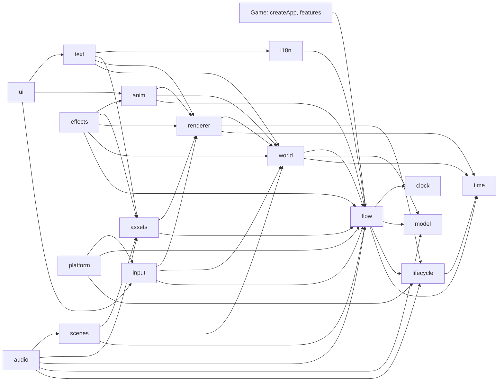

# @moku-labs/game — Plugin & Property Index

**Synced version:** `0.13.0` (catalog from the `v0.13.0` tag: `llms.txt`, `docs/plugins.md`, `docs/events.md`,
`docs/configuration.md`, `docs/doors.md`, `docs/shell.md`, `docs/lint.md`, `docs/testing.md`,
`docs/hot-swap.md`, `docs/project-index.md`, `src/plugins/*/README.md`, and the export lists of
`src/index.ts`, `src/app.ts`, `src/cli.ts`, `src/testing.ts`, `src/visual.ts`, `src/project.ts`).
`@moku-labs/core ^1.7.1` and `@moku-labs/common ^0.3.4` are **peer** dependencies (Bun installs them on
`bun add`). `pixi.js ^8.0.0` is a **peer** dependency. Optional peers: `playwright-core` (the pixel leg of the
visual tests), `sharp` (the asset pack), `typescript >=5.5` (the project index), `@moku-labs/system ^0.3.1`
(the system shell, the store save), `@moku-labs/native ^0.3.2` (`moku-game native`). Engines node ≥24,
bun ≥1.3.14. ESM only.

The second half indexes **`@moku-labs/editor@0.9.1`** (peers `@moku-labs/game >=0.10.0` and
`typescript >=5.5`).

> The package ships `llms.txt` since 0.4.0 (`node_modules/@moku-labs/game/llms.txt`). It matches the
> installed version.

| Version | What changed for a game |
|---|---|
| 0.13.0 | `moku-game keys` writes the dev manifest to `generated/manifest.json`, not `<root>/manifest.json`. `dev` serves it on `/manifest.json`, so the page still fetches `manifest.json` next to itself. The project index reads it by default. The build output is unchanged: `dist/assets/manifest.json`. `moku-game-assets` keeps its own `--manifest` default |
| 0.12.0 | `moku-game visual` runs `tests/visual/index.ts` against `tests/visual/baselines/`. `test-suffix` passes the `index.ts` of a test kind folder. A texture in an `fx/` folder packs into the `fx` atlas group. Root exports `messageArgument`, `messageDuration` (a generated strings module imports them). `parseVisualArgv` reads `--pixels` |
| 0.11.0 | `PlatformApi.exit()`. The page bundles only the system plugins `config.ts` names |
| 0.10.0 | The game shell: `defineGameApp`, `config.ts` (`GameConfig`), the bin `moku-game`, `startPage`, `preparePage` |
| 0.9.0 | The layered layout: `--layer`, `layer-imports`, `feature-door`, `test-suffix`, hot swap of the kind folders. The `AnimPlayer` resource; `resource(name, () => value)` |
| 0.8.0 | The entry `./visual`; `./testing` has no `node:` import. `audioPlugin`, `effectsPlugin`, `platformPlugin` are named in the root entry. The merge game left the engine for moku-labs/demos |
| 0.7.x | `static-keys`; `{prop}` holes in JSX keys; `component:<Name>` and style-factory keys in the project index |
| 0.6.0 | The entry `./project` and the bin `moku-game-index` |
| 0.5.0 | The entry `./hot`; `replace` on `world.projection`, `anim`, `i18n`; `text.replaceStyles`; `scenes.expect`; the bookmark `scene`; the global event `ui:hot-swap` |

The rows 0.5.0 to 0.9.0 are read from the source of each tag and the commit subjects between the tags.

**Breaking in 0.4.0** (pre-1.0): a literal `{ component, field }` text bind became `bind(Component, "field")`;
`game.capture` answers `{ png }`, not a string; `game.rect` became `game.locate`; `assets.audio(key)` answers
`{ bytes, mime }`; `runCli(argv, strings)` takes `{ compile, exportStrings, importStrings }`.

## Plugin sets

```ts
// what game.screen() of defineGameApp composes; a game writes no createApp
createApp({ plugins: [...screen, audioPlugin, effectsPlugin, platformPlugin, shared, ...features, ...gamePlugins] });
```

| Set | Plugins | How |
|---|---|---|
| logic | `time`, `lifecycle`, `model`, `clock`, `flow` | always registered, in this order |
| screen | `world`, `renderer`, `input`, `assets`, `scenes`, `anim`, `i18n`, `text`, `ui` | the exported list `screen` |
| opt-in | `effects`, `audio`, `platform` | append; `platform` last |

`log` and `env` from `@moku-labs/common` sit on every context as `ctx.log` and `ctx.env`. A feature name
is refused when it equals any plugin name above, or `log` / `env`.

## The 17 plugins

| Plugin | Tier | Depends on | Owns | App API (`app.<name>`) |
|---|---|---|---|---|
| `time` | Standard | — | One `requestAnimationFrame` loop, six phases `input, animate, layout, sync, signals, render`, the `Time` resource `{ delta, elapsed, scale, frame, idle }`. Idle cap after `idleAfterMs` | `onFrame(phase, cb): () => void`, `snapshot()`, `setScale(scale)`, `pause()`, `resume()`, `isPaused()`, `isRunning()`, `step(deltaMs)`, `wake()` |
| `lifecycle` | Standard | time | The stack of pause reasons: `"background"`, `"devtools"`, `"system-dialog"`, `"device-lost"`, any string | `push(reason)`, `pop(reason)`, `reasons()`, `isPaused()` |
| `model` | Very Complex | — | The `session` tree and the save document `{ player, rng }`; transactions, rest-point rollback, rng streams, migrations | `store.load()`, `store.snapshot()` (frozen `{ player, session, rng }`), `store.begin()`, `store.markRest()`, `store.markBarrier(txId)`, `store.rollback()`, `store.restore(input)`, `store.flush()`, `rng.peek(id)` |
| `clock` | Standard | — | Trusted time: monotonic `now()`, one `elapsed` signal at the next due moment | `now()`, `scheduleAt(moment \| undefined)`, `onElapsed(listener)`, `poke()`, `dueAt()` |
| `flow` | Very Complex | time, lifecycle, model, clock | The graph: runner, gate, inbox, effects gateway, features registry | `run()`, `onEnter("load" \| "scene", cb)`, `walk(route, { from? })`, `bookmark()`, `restore(bookmark)`, `describe()`, `state()`, `history()`, `setMode("live" \| "fast")`; `gate.answer({ intent, payload? }): boolean`, `gate.pointer(active)`, `gate.state()`; `inbox.post({ type, payload? })`; `fx.handle(kind, handler, { runInFast? })`, `fx.dispatch(descriptor)`; `features.register(name, description)`, `features.all()`, `features.contributions(slot)` |
| `world` | Very Complex | time, model, flow | A zero-dependency ECS and the projection from committed state to entities: keyed reconcile of one `view(item)`, retarget motions, despawn queue, named layers | `ecs.spawn(owner, components)`, `ecs.query(...C)`, `ecs.system(def)`, `ecs.set(entity, C, patch)`, `ecs.changed(C)`, `ecs.snapshot()`, `ecs.mode()`; `projection.mount(names, owner)`, `projection.replace(spec)` (dev hot swap), `projection.setLayers(list)`, `projection.settle(entity)`, `projection.keyOf(entity)`, `projection.entityOf(projection, key)` |
| `renderer` | Very Complex | time, lifecycle, world | Pixi v8 host loaded lazily, one `sync` system that owns every display object, the reference viewport, frame stats | `host.ready()`, `host.kind()`, `host.canvas()`, `host.pixi()`, `host.device()`, `host.gl()`; `sync.hitTest(x, y, accept)`, `sync.hitAll(x, y)`, `sync.boundsOf(entity)`, `sync.hitBoxOf(entity)`, `sync.textures.provide(fn)`, `sync.fonts.install(key, fnt, texture)`, `sync.filters.set(entity, slots)`, `sync.displayOf(entity)`, `sync.debug.nineSlice(on)`; `viewport.toReference(x, y)`, `viewport.toScreen({ x, y })`, `viewport.size()`; `stats()`, `capture(options?)` (dev only, `{ png, legend? }`; options `legend`, `layers`, `sheet`, `against`) |
| `input` | Standard | flow, world, renderer | Gestures as data components `Tappable`, `Pressable`, `Draggable` (`{ payload, carry }`: `carry` lists keys of the same projection that ride along, a solitaire stack), `DropTarget`, `Swipeable`, `Traceable` (a word-game path of cells), `Touchable`, `Held`, `Hovered`, `PointerOver`, `Pressed`, `Traced` (on every cell of the trace in progress), `Pointer`; the intent reaches `flow.gate`. A trace answers once on release: `{ intent, payload: { path: [payload, …] } }` | `tap(target)`, `press(target)`, `drag(from, to)`, `swipe(target, direction)`, `trace(path)`, `pressKey(key, { shift })` |
| `assets` | Complex | flow, renderer | Manifest, five tiers, graph-driven preload, texture budget with LRU unload, typed keys from the `./assets` door | `load(bundle)`, `unload(bundle)`, `isLoaded(bundle)`, `texture(key)`, `font(key)`, `audio(key)` (`{ bytes, mime }` since 0.4.0), `usage()` |
| `scenes` | Standard | flow, world, assets | A scene as a declaration: bundle, layers, projections, `music`. A node names its scene; the switch runs in `flow.onEnter("scene")` | `current()`, `expect(id)` (the scene the next rest node without its own `scene` mounts; the restore door calls it; an unknown id throws) |
| `anim` | Complex | flow, world, renderer | The one tween core, timelines as frozen data from typed slots, `defineMotion` for enter/exit/change, the `Frames` component, the `AnimPlayer` resource a system plays through: `res(AnimPlayer).play(animation, slots)` | `play(animation, slots)`, `finishAll()`, `active()`, `onMark(fn)`, `replace(definition)` (dev hot swap), `setReducedMotion(on)`, `reducedMotion()` |
| `i18n` | Complex | flow | Strings as data: `tr(key, params)` is a `Message`; ICU MessageFormat compiled by `compileStrings`; `Part[]` at run time | `locale()`, `setLocale(locale)` (async), `format(message, locale?)`, `plain(message)`, `has(key)`, `duration(ms, style?)`, `locales()`, `replace(locale, messages)` (dev hot swap of a generated strings file). ICU `{x, duration, short}`; a string may be `{ "text", "note" }` for translators; pseudo-locale `en-XA` |
| `text` | Complex | time, flow, world, renderer, assets, i18n | The `Text` component, `label()`, `defineTextStyles()`, tags `<b> <i> <color=#hex> <icon=key>`, measurement from the font's advance table, BitmapText from MSDF fonts; `bind(Component, "field", { format? })` shows a numeric component field (`int`, `mm:ss`, `h:mm:ss`, `duration`); `Countdown({ until })` counts down to a `clock` moment | `measure(content, style)`, `hasGlyph(char, style)`, `styles()`, `replaceStyles(styles)` (dev hot swap) |
| `ui` | Very Complex | input, anim, text | A screen is a projection whose `view` returns JSX; reconciled by identity into entities, one Yoga solve per change; `defineComponent` with `local` and `outcomes`, `popup` as an effect, `defineStyle`, `defineTokens`; the `input` tag is a text field; `scroll` has a windowed form `rows`, `rowHeight`, `overscan` (5), `row`; plays `change` hooks of any component in `motion`; emits the dev global event `ui:hot-swap` | `tree()` (a text node carries `content`, the words it draws after `tr()` and `bind`; a text field carries `value`), `find(key)`, `lint()`, `fill(key, value)` |
| `audio` | Standard | lifecycle, model, flow, assets, scenes | Opt-in. Buses `master`, `music`, `sfx`; `sfx()` and `music()` descriptors; the scene's `music`; volumes from the committed player; music `"decode"` (gapless buffer) or `"stream"` (`<audio>` element, about 12 MB instead of 58 MB); the iOS audio session (`"ambient"` by default) | `setVolume(bus, value)`, `volume(bus)`, `mute(bus, on)`, `muted(bus)` (since 0.4.4), `unlocked()`, `journal()` |
| `effects` | Complex | flow, world, renderer, assets, anim | Opt-in. Particles (`defineEmitter`, `Emitter`); filters (`defineFilter` with WGSL + GLSL twin; built-in `Glow`, `Outline`, `Blur`, `ColorMatrix`, `Noise`, `Displacement`, `Alpha`). Headless draws nothing | `stats()` |
| `platform` | Standard | lifecycle, flow, input | The phone as a `PlatformProvider`: pause/resume → `"background"`, Back chain (Escape, then intent `back`, then `exit()`), `haptic` effect, `keepAwake`. Inert without a provider. The shell fills the provider from `config.ts` `system` | `back()`, `exit()` (since 0.11: leaves through the provider; a throw is logged; nothing without a provider) |

### Dependency graph



## Root exports

| Export | Kind | Purpose |
|---|---|---|
| `createApp`, `createPlugin` | functions | The game app; a game plugin bound to the engine's config and events |
| `defineGame<Types>()` | function | Returns the typed kit: `defineNode`, `defineFlow`, `defineFeature`, `projection`, `sprite`, `Sprite`, `NineSlice`, `defineBundles`, `load`, `defineScene`, `tr`, `label`, `defineTextStyles`, `defineComponent`, `defineStyle`, `defineTokens`, `popup`, `defineAnimation`, `frames`, `sfx`, `play`, `music`, `Frames`, `defineEmitter`, `Emitter`, `Displacement`. `Types = { player; session; assets: string; bundles?: string; scenes?: string; strings: Record<string, unknown>; textStyles?: string; emitters?: string }` |
| `defineFeature` | function | Untyped twin of the kit's. Keys: `nodes`, `flows`, `contribute`, `projections`, `systems`, `components`, `scenes`, `assets`, `animations`, `ui`, `strings`, `textStyles`, `emitters`, `filters` |
| `type`, `exit`, `to`, `slot` | functions | Payload type tag; the three edge helpers |
| `schedule`, `guide`, `hint` | functions | Effect descriptors: next due moment, tutorial narrowing of the gate, cosmetic hint |
| `SaveUnreadableError` | class | From `model.store.load()`: `savedVersion`, `schemaVersion` |
| `component`, `tag`, `resource`, `mut`, `system`, `projection`, `Layer`, `Order`, `Exiting`, `Tree` | ECS vocabulary | From `world`. `resource(name, defaults)` clones plain defaults into every world; `resource(name, () => value)` calls the factory once per world, so the value may hold a `Map` or a function |
| `Transform`, `Sprite`, `NineSlice`, `Shape`, `Parent`, `Display`, `sprite` | components | From `renderer` |
| `Tappable`, `Pressable`, `Draggable`, `DropTarget`, `Swipeable`, `Traceable`, `Touchable`, `Held`, `Hovered`, `PointerOver`, `Pressed`, `Pointer`, `Traced` | components | From `input` |
| `defineBundles`, `load`, `defineScene` | functions | Bundles and scenes |
| `defineAnimation`, `sequence`, `parallel`, `stagger`, `tween`, `set`, `wait`, `mark`, `frames`, `sfx`, `haptic`, `use`, `spawn`, `spawned`, `play`, `external`, `defineMotion`, `Animation`, `Frames`, `AnimPlayer` | anim | Choreography as frozen data; `play(animation, slots)` is the effect a node awaits; `spawn` makes a temporary entity the timeline despawns. A system cannot `require` a plugin, so it plays through the resource: `res(AnimPlayer).play(animation, slots)`. Before `anim` starts it throws `[game] AnimPlayer is not ready: anim has not started.` |
| `tr` | function | `tr(key, params?)` → frozen `Message` |
| `messageArgument`, `messageDuration` | functions | What a generated `strings.<locale>.ts` imports since 0.12: `messageArgument(value, intl)` formats one argument, `messageDuration(ms)` splits a duration (`95_000` gives `{ minutes: 1, seconds: 35 }`). A game never calls them |
| `Text`, `label`, `defineTextStyles`, `bind`, `Countdown`; types `BindOptions`, `CountdownValue`, `TextFormat` | text | Words on screen; `bind` and `Countdown` show numbers and timers |
| `defineComponent`, `popup`, `defineStyle`, `defineTokens`, `resolve`, `Box`, `LocalWrite` | ui | Components, the popup effect, the style vocabulary |
| `music` | function | `music(key \| null, { fadeMs? })` |
| `defineEmitter`, `Emitter`, `defineFilter`, `Glow`, `Outline`, `Blur`, `ColorMatrix`, `Noise`, `Displacement`, `Alpha` | effects | Particles and filters as data |
| `PlatformProvider`, `BackResult`, `HapticKind`, `HAPTIC_KINDS` | types, constant | The seam a game fills for `platform` |
| `timePlugin` … `platformPlugin`, `screen` | plugin instances | For `depends` and `ctx.require`. All 17 are named exports: `timePlugin`, `lifecyclePlugin`, `modelPlugin`, `clockPlugin`, `flowPlugin`, `worldPlugin`, `rendererPlugin`, `inputPlugin`, `assetsPlugin`, `scenesPlugin`, `animPlugin`, `i18nPlugin`, `textPlugin`, `uiPlugin`, `audioPlugin`, `effectsPlugin`, `platformPlugin` |
| `Time`, `Lifecycle`, `Model`, `Clock`, `Flow`, `World`, `Renderer`, `Input`, `Assets`, `Scenes`, `Anim`, `I18n`, `TextTypes`, `Ui`, `Audio`, `Effects`, `Platform` | type namespaces | `import type { Flow } from "@moku-labs/game"` then `Flow.RouteStep`, `Flow.NodeContext`, `Model.Json`, `Model.PlayerStateProvider`, `Clock.ClockSource`, `Anim.Target`. `Text` is the component, so its types are `TextTypes` |

## Game shell

| Entry | Runs in | Exports |
|---|---|---|
| `@moku-labs/game/app` | anywhere | `defineGameApp`, `startMoment` (`1_000_000`), types `GameConfig`, `GameDefinition`, `GameApp`, `GameHandle`, `GamePluginConfigs`, `HeadlessSeams`, `ScreenSeams`, `MemoryProvider`, `Scenario`, `PageAgent`, `SaveKind`, `SystemName`. No `node:` import, no system or native package |
| `@moku-labs/game/app/page` | browser | `startPage(game, config, { scenarios?, system?, agents?, devModules? })`: the page `moku-game` writes calls it |
| `@moku-labs/game/app/system` | browser, native shell | `systemShellOf`, `fromSystem`, `storeSave`, `createSystemApp`, types `SystemApp`, `SystemSlice`, `StoreSlice`, `SystemModules` |
| `@moku-labs/game/cli` | node, bun | `runCli`, `preparePage(root, { agents?, preload?, servePlugins? })` → `{ html, bunfig }` (the editor calls it) |
| bin `moku-game` | bun | `dev [--port 3000] [--packed]`, `build [--out dist/web]`, `native build|dev|doctor|clean [<target>] [--simulator]`, `keys [--check]`, `pack [--no-cache]`, `visual [--update] [--only <name>] [--no-pixels \| --pixels] [--webgl] [--dir <path>] [--tests <file>] [--url <url>]`, `help`. Every command: `--root`, `--preload`, `--serve-plugin` |

| `moku-game` flag | Command | Default | What |
|---|---|---|---|
| `--root <dir>` | every | `.` | The game folder, against the cwd |
| `--preload <path>` | every | none | A file Bun preloads. Repeats |
| `--serve-plugin <path>` | `dev`, `build`, `native`, `visual` | none | A Bun plugin the page bundles with, after the hot plugin. Repeats |
| `--port <n>` | `dev` | `3000` | An integer 0-65535. `0` takes a free port |
| `--packed` | `dev` | off | Serves `dist/assets` instead of the raw files |
| `--out <dir>` | `build` | `dist/web` | The output folder, replaced by the run. A folder that is the game, holds it, touches `dist/assets`, or lies in the game outside `dist/` is refused |
| `--simulator` | `native build` | off | iOS: the simulator build |
| `--check` | `keys` | off | Fails when an output is out of date |
| `--no-cache` | `pack` | off | A cold pack |
| `--tests <file>` | `visual` | `tests/visual/index.ts` | The tests module, against the cwd |
| `--dir <path>` | `visual` | `tests/visual/baselines` | The baselines folder, against the cwd |
| `--update` | `visual` | off | Rewrites the baselines of every test it runs |
| `--only <name>` | `visual` | every test | Runs one test. Repeats |
| `--no-pixels`, `--pixels` | `visual` | pixels on a Mac only | The headless leg alone, or the pixel leg off a Mac too. The last one wins |
| `--webgl` | `visual` | off | The tests with `webgl: true`, on the page with `?renderer=webgl` |
| `--url <url>` | `visual` | the page served for the run | A page that is served already, such as `moku-game dev` |

The exit code is `0` on success, else `1` and a `[game] …` line. `visual` exits `1` when a checkpoint
differs or a test fails. What `moku-game` writes: `dev` writes `.moku/{index.html,dev.ts,main.ts,bunfig.toml}`;
`visual` writes its own page into `.moku/visual/` when the pixel leg runs without `--url`, so it runs
while `dev` or the editor serves the game; `native` writes `.moku/tauri` and `dist-native`; `build`
writes nothing under `.moku/`.

| `defineGameApp` key | Default | What |
|---|---|---|
| `flow`, `player`, `session` | required | The main flow, the new player, the session at every start |
| `safeNode` | the start of the main flow | The checkpoint after a failed retry |
| `referenceLong`, `seed` | `1920`, `42` | Layout long side; the rng seed of a new save |
| `shared`, `features`, `plugins` | none, `[]`, `[]` | The screen app composes them in this order, after the engine plugins |
| `headless` | `{}` | `{ features?, plugins? }`: what `game.headless()` composes (`logicOnly` of the features) |
| `pluginConfigs` | `{}` | Every plugin config but the shell's keys: `model` `playerProvider`, `initialPlayer`, `initialSession`, `seed`; all of `clock`, `platform`; `flow` `mainFlow`, `safeNode`; `renderer.mount`; `assets` `manifest`, `io`; `audio.context` |

Seams of `game.headless(seams?)` and `game.screen(seams?)`: `seed`, `clock`, `provider`, `player`, `session`.
Screen only: `manifest` (a URL or the parsed file), `io`, `platform`, `keepAwake` (`false`),
`audio { context?, journal? }`, `renderer { mount?, loadPixi?, preference? }`. Both return
`{ app, clock, provider }`, the app not started.

`GameConfig` (`config.ts`): `page { title, lang?, background?, orientation?, icons?, head? }`,
`native? { name, identifier, icon?, targets? }`, `system?` (`lifecycle`, `back`, `haptics`, `keepAwake`,
`store`), `save?` (`"memory"`, `"local"`, `"store"`), `assets? { layers? }`.

## Other entries

| Entry | Runs in | Exports |
|---|---|---|
| `@moku-labs/game/testing` | anywhere (no `node:` import since 0.8) | `createHeadless`, `runRepro`, `stepFrames`, `fakeClock`, `memory`, `saveOf`, `isolate`, `stub`; types `HeadlessApp`, `HeadlessGame`, `Repro`, `ReproResult`, `IsolateOptions`, `IsolateSeams`, `Stub`, `StubsOf` |
| `@moku-labs/game/visual` | node, bun | `defineVisualTest(name, { start, steps, webgl? })`, `runVisualTests(setup, tests, options?)`, `parseVisualArgv(argv)` (`--update`, `--no-pixels`, `--pixels`, `--webgl`, `--only <name>`, `--dir <path>`); types `VisualTest`, `VisualStart`, `VisualStep`, `VisualSetup` (`{ app, page? }`), `VisualApp`, `VisualPage`, `VisualOptions`, `VisualRenderer`, `VisualTolerance`, `VisualReport`, `VisualTestResult`, `CheckpointResult`. The bin runs them: `moku-game visual` |
| `@moku-labs/game/assets` | node, bun | `scanAssets`, `emitKeys`, `emitManifest`, `compileStrings`, `checkStrings`, `packAssets`, `exportStrings`, `importStrings`, `runCli(argv, { compile: compileStrings, exportStrings, importStrings })`. Flags: `--root <dir>` (default `.`), `--manifest <file>` (default `<root>/manifest.json`), `--keys <file>` (default `<root>/generated/assets.ts`), `--pack <dir>`, `--check`, `--no-cache`, `--pseudo` (en-XA), `--export <dir>`, `--import <dir>`, `--source <locale>` (default `en`). `--layer <folder>[=<name>]`. Audio `.mp3` or `.m4a`. Bin `moku-game-assets` (Bun shebang); a game with `config.ts` runs `moku-game keys` and `pack` instead |
| `@moku-labs/game/fonts/*` | files | `font-body.fnt`, `font-body.png` (Pangolin Regular MSDF, one 512×512 page), `LICENSE.txt` (SIL OFL 1.1). Copy into `shared/assets/` (scanned as the layer `ui`) for the key `ui.font-body` |
| `@moku-labs/game/inspect` | anywhere | `read`, `watch`, `defineSource`, `sources`, types `Source`, `InputSchema`, `InputOf` |
| `@moku-labs/game/control` | dev builds | `run`, `defineCommand`, `controlRefused`, `commands`, types `Command`, `Ran` |
| `@moku-labs/game/jsx-runtime`, `/jsx-dev-runtime` | anywhere | What `"jsxImportSource": "@moku-labs/game"` resolves to |
| `@moku-labs/game/lint` | oxlint 1.86.0+ (`jsPlugins`) | Default export: the plugin `moku-game` with ten rules; `aliasTargetsOf`. See "Lint rules" below |
| `@moku-labs/game/hot` | the Bun dev server | Default export: the Bun plugin that hot swaps views; `hot({ include?, exclude? })` for another layout. `moku-game dev` lists it first in `.moku/bunfig.toml`; `moku-game build` never loads it. See "Hot swap" below |
| `@moku-labs/game/project` | node, bun | `openProject({ root, manifest?, tsconfig?, debounceMs? })` → `ProjectApi` (`index`, `find(key)`, `watch(onIndex)`, `changed(path)`, `close()`); types `Anchor`, `Found`, `IndexUi`, `JsxKind`, `ProjectApi`, `ProjectChange`, `ProjectIndex`, `ProjectOptions`. Needs the optional peer `typescript`. Bin `moku-game-index`. See "Project index" below |

### Lint rules (`@moku-labs/game/lint`)

```json
{
  "jsPlugins": ["@moku-labs/game/lint"],
  "rules": {
    "moku-game/lazy-imports": "error",
    "moku-game/native-imports": "error",
    "moku-game/dev-imports": "error",
    "moku-game/no-module-state": "error",
    "moku-game/determinism": "error",
    "moku-game/rules-siblings": "error",
    "moku-game/static-keys": "error",
    "moku-game/layer-imports": "error",
    "moku-game/feature-door": "error",
    "moku-game/test-suffix": "error"
  }
}
```

| Rule | Engine rule | Reports | Default `files` |
|---|---|---|---|
| `lazy-imports` | L2 | Static value import of `pixi.js`, `yoga-layout`. `import type`, `import()` pass. `import { type A }` is reported | `**` |
| `native-imports` | L13 | `@moku-labs/system`, `@moku-labs/native`, `@tauri-apps/*` | the logic, `config.ts`, `**/kit.ts`, `**/plugins/**` |
| `dev-imports` | dev only | `@moku-labs/editor`, `@moku-labs/game/control` | all but `.moku/**`, `*.dev.ts(x)`, tests |
| `no-module-state` | L5 | Module-scope `let`, `var`, `new Map/Set/WeakMap/WeakSet` | `**` |
| `determinism` | L3 | `Math.random`, `Date.now`, `performance.now`, `new Date()`, `setTimeout`, `setInterval`. `new Date(now)` passes. Plugin folders `**/{plugin,plugins}/**` are the effect side and are skipped | the logic |
| `rules-siblings` | L4 | An import that is not a sibling, `@core/types` or `@shared/rules` | `**/rules/**` |
| `static-keys` | keys | A JSX `key` the project index cannot follow | `**/*.tsx` |
| `layer-imports` | layers | An import above its own layer: core ← shared ← features ← `game.ts`; plugins import core and shared | `**`, not `generated/` |
| `feature-door` | doors | A deep import of another feature, a barrel below `game.ts`, a feature's own door, a relative import out of a feature | `**/{core,shared,features,plugins}/**` |
| `test-suffix` | tests | A file in a test kind folder without the folder's suffix: `tests/e2e/` `.e2e.ts`, `tests/visual/` `.visual.ts`, `tests/editor/` `.editor.ts`, `__tests__/`, `__tests__/unit/`, `__tests__/integration/` `.test.ts`, `__tests__/isolated/` `.isolated.ts`, `__tests__/visual/` `.visual.ts`; a `.tsx` file adds an `x`. Since 0.12 the folder's `index.ts` passes (`tests/visual/index.ts`). Helpers go to `tests/helpers/` or `__tests__/fixtures/` | `**/tests/**`, `**/__tests__/**` |

- The logic = the root `index.ts`, `**/state.ts`, `**/tables.ts`, `**/game.ts`,
  `**/{core,nodes,flows,rules,features,shared}/**`.
- Every rule but `test-suffix` skips `tests/**`, `**/__tests__/**`, `*.{test,spec}.{ts,tsx}`.
- The layout rules take `root` and `tsconfig` and read the tsconfig `paths`; without them the v15 aliases
  (`@core/*`, `@shared`, `@features/*`, …).
- Options per rule: `["error", { "files": [...], "ignores": [...] }]`. Globs are relative to the
  directory oxlint runs in. A key given replaces the default. `test-suffix` also takes `root` and
  `suffixes` (kind folder to suffix; it replaces the table whole).
- Layers under the game root: `core/**`, `shared/**`, `features/<f>/**`, `plugins/<p>/**`, `generated/**`,
  `game.ts`, `tests/**`. Every layer may import `generated/`. Only `game.ts` imports `game.ts`.
- Types: `GameLintOptions`, `GameLintLayoutOptions`, `GameLintSuffixOptions`, `GameLintPlugin`,
  `GameLintRuleName` from `@moku-labs/game/lint`.

## Visual tests (`@moku-labs/game/visual`, `moku-game visual`)

```ts
// tests/visual/index.ts: what `moku-game visual` reads
import game from "../../index";
import { home } from "./home.visual";

export default { app: { app: () => game.screen().app }, tests: [home] };
```

- The default export is the two arguments of `runVisualTests`: `app`, a `VisualSetup` `{ app, page? }`,
  and `tests`, the list of `defineVisualTest` results. A bare app factory is refused: `[game] visual:
  tests/visual/index.ts must export default { app, tests }.`
- A step is a `/control` command by its short name (`answer`, `tap`, `drag`, `key`, `fill`, `walk`,
  `restore`, `step`, `pause`, `resume`, `reducedMotion`) with that command's input, or `{ checkpoint: "name" }`.
- A checkpoint writes `tests/visual/baselines/<test>/<checkpoint>/state.json`, `describe.json` and
  `screen.webp`. A missing file is written, `--update` rewrites, any other file is compared.
- The headless leg plays in plain Bun and compares `state.json` and `describe.json` exactly. The pixel
  leg plays the same steps in Chrome on a Mac and compares `screen.webp` (a pixel differs above 24 per
  channel, a checkpoint above 0.1 % of pixels). It needs the optional peer `playwright-core`. A pixel
  difference writes `screen.actual.webp` and `screen.diff.webp` beside the baseline.
- `--webgl` runs only the tests with `webgl: true` and writes `screen.webgl.webp`.
- Without `generated/manifest.json` a run that serves the page stops: `[game] visual: no generated/manifest.json in "<game>".`
  with `Run "moku-game keys" first.`
- An app made with `game.screen()` and no `{ manifest, io }` seam measures text at 0.6 em and warns
  `text: the font is not loaded`. A game that wants the page's layout in `describe.json` passes the
  parsed manifest and a file seam of its own; the engine's fixture does it in
  `tests/integration/mini-helpers.ts` (`folderIo`), which is not in the npm package.

## Hot swap (`@moku-labs/game/hot`, dev only)

`moku-game dev`, `moku-game visual` and the editor's engine page list the plugin first in the bunfig they
write, so a game sets nothing. `moku-game build` never loads it.

| A save of | Does |
|---|---|
| `.tsx`, `styles.ts`, `view.ts`, `animations.ts`, `effects.ts`, `generated/strings.<locale>.ts`; any `.ts` directly in `styles/`, `motion/`, `effects/`, `views/`, `world/projections/`, `world/layout/` of a feature or of `shared/` | Swaps the module in the running page: same state, same node, no reload. Logs `ui:hot-swap` and emits the global event |
| `rules/`, `nodes/`, `flows/`, `state.ts`, `tables.ts`, `kit.ts`, a feature `index.ts`, `world/components/`, `world/systems/` | Reloads the page; the editor restores the state |
| A view file that exports a scene, system, ECS component, filter, flow, node, feature, plugin, a new projection or a new animation | Refused: `ui` logs `ui:hot-refused` and throws, and Bun reloads the page |

- What swaps: styles, components, function components, projections of a registered name, animations,
  text styles, emitters, strings. After a strings JSON edit run `bun run keys`: its output is what swaps.
- Keep a view helper in the module of the projection that uses it. A function another module stored into
  an object at load time keeps the old version.
- A game with a server of its own lists the plugin in its own `bunfig.toml`: `[serve.static]` `plugins =
  ["@moku-labs/game/hot"]`. Another layout: `export default hot({ include, exclude })` from the game's
  `hot.ts`, listed as `plugins = ["./hot.ts"]`.

## Project index (`@moku-labs/game/project`, bin `moku-game-index`)

Maps every engine id of a game to anchors (a path plus a binding, a key or a component), never to line
numbers; `find` reads the line from the file on disk at the call. It follows the tsconfig `paths`.

| Key | Names |
|---|---|
| `flow:<id>`, `node:<flow>/<node>` | A flow; every entry of a `nodes` table (node, sub-flow, slot) |
| `feature:<id>`, `scene:<id>`, `projection:<name>`, `emitter:<id>`, `textStyle:<key>` | The definer call of that id |
| `style:<path>#<binding>`, `style:<path>#<function>`, `style:<path>#<function>.<property>` | A `defineStyle` const, or the calls inside a module-level function |
| `component:<Name>` | An upper-case function in a `.tsx` file, or `defineComponent("Name", …)`; `uses` are the files that render it |
| `jsx:<key>` | A JSX `key`. A key-carrying prop (`id`, or a name that ends in `Key`) is a hole: `` key={`${props.id}Close`} `` reads `jsx:{id}Close` |

```sh
bunx moku-game-index --root . where node:main/home    # <path>:<line> per place; exit 1 for an unknown key
bunx moku-game-index --root . --check                 # exit 1 on a broken file or a key in conflict
bunx moku-game-index --root . --json                  # the whole index
```

- `--root` is required. `--manifest <path>` and `--tsconfig <path>` are root-relative. The manifest defaults to
  `generated/manifest.json` (since 0.13.0).
- A non-literal id goes to `index.unresolved` with the reason, never guessed. `moku-game/static-keys`
  keeps JSX keys followable.
- `typescript` (`>=5.5`) is an optional peer: without it `openProject` rejects with `[game] The project
  index needs the "typescript" package.` The index reads through the TypeScript JS API, which
  TypeScript 7 does not have.

## Asset pack groups

`moku-game pack` puts the textures of one bundle into atlas groups. `fx` holds the textures whose key's
last segment starts with `fx-` (`ui.fx-spark`), and since 0.12 everything in an `fx` folder (`ui.fx.leaf`
from `assets/fx/leaf.webp`, the frames `ui.fx.coin-spin.0` too), whatever the size: a particle emitter
binds one page. `main` holds every other texture with no side above 512 px. A stem named `fx` with no
folder (`ui.fx`) is not an fx folder.

## Events

One event is global: `ui:hot-swap`, so `effects` hooks it with no `depends` on `ui`. Every other event
belongs to a plugin. `time`, `clock`, `text`, `audio`, `effects`, `platform` emit nothing; `ui` emits only
the dev `ui:hot-swap`.

| Event | Emitted by | Payload | When |
|---|---|---|---|
| `lifecycle:changed` | `lifecycle` | `{ reason, action: "push" \| "pop", reasons, paused, resumed }` | The pause stack changed; `resumed` only on the change that emptied it |
| `model:committed` | `model` | `{ roots: ("player" \| "session" \| "rng")[], cause: "edge" \| "rollback" \| "restore" \| "load" }` | Committed state changed |
| `flow:edge` | `flow` | `{ flow, node, outcome, payload, next, patches: { doc, session }, index, now }` | After the commit of an edge |
| `flow:rest` | `flow` | `{ path, checkpoint }` | The graph entered a rest node |
| `flow:error` | `flow` | `{ path, error, rolledBackTo, retry }` | A node failed and the graph rolled back |
| `world:reconciled` | `world` | counts per reconcile | Dev only, behind `reconciledEvent` |
| `renderer:device-lost` | `renderer` | `{ kind, reason }` | GPU device or context lost; `lifecycle` pushed |
| `assets:bundle-loaded` | `assets` | `{ bundle, tier, mb, reason: "boot" \| "enter" \| "request" \| "preload" }` | A bundle entered memory |
| `assets:bundle-unloaded` | `assets` | `{ bundle, tier, mb, reason: "budget" \| "request", keys }` | A bundle left memory |
| `assets:bundle-progress` | `assets` | `{ bundle, loaded, total }` | For a loading bar; no engine plugin listens |
| `scenes:changed` | `scenes` | `{ from, to, music }` | The scene switched on entering a node |
| `anim:mark` | `anim` | `{ animation, mark }` | A `mark` step was reached |
| `anim:finished` | `anim` | `{ animation }` | A timeline ended or was finished; never on cancel |
| `i18n:locale-changed` | `i18n` | `{ locale }` | The new locale's module is loaded, or `replace` swapped messages of the current locale or the fallback; never at start |
| `ui:hot-swap` | `ui`, global | `{ file: string; module: Readonly<Record<string, unknown>> }` | Dev only: a saved view module was swapped; `module` is its new exports. `effects` replaces its emitters |

```ts
import { createPlugin, flowPlugin } from "@moku-labs/game";

export const edgeLog = createPlugin("edgeLog", {
  depends: [flowPlugin],
  hooks: ctx => ({
    "flow:edge": payload => {
      ctx.log.info("edge", { node: payload.node, outcome: payload.outcome });
    }
  })
});
```

A hook that throws never stops the game: the engine logs `"game: a hook failed"` through `onError`. A
plugin that owns a resource frees it in `onStop: ({ global, config, state }) => …`.

## Configuration

### Global

```ts
createApp({ config: { orientation: "portrait", referenceSide: 1080, referenceLong: 1920 } });
```

| Key | Type | Default | Meaning |
|---|---|---|---|
| `orientation` | `"portrait" \| "landscape"` | `"portrait"` | Orientation the game is designed for |
| `referenceSide` | `number` | `1080` | Short side of the reference resolution |
| `referenceLong` | `number` | `1920` | Long side the layout needs inside the safe area; scale is `min(short / referenceSide, safeLong / referenceLong)` |

### Per plugin (`pluginConfigs.<plugin>`)

A game sets them in `index.ts`: `defineGameApp({ pluginConfigs })`. The keys the shell writes from the
seams are not in that type (see "Game shell"); the table lists them because `createApp` by hand takes them.

| Plugin | Key | Type | Default | Meaning |
|---|---|---|---|---|
| `time` | `maxFps` | `30 \| 60 \| 120` | `60` | Frame rate cap |
| `time` | `maxDeltaMs` | `number` | `50` | Upper bound of one frame's delta |
| `time` | `idleFps` | `0 \| 30` | `30` | Cap of an idle screen; `0` turns it off |
| `time` | `idleAfterMs` | `number` | `2000` | Idle after this long without a `wake()` |
| `lifecycle` | — | | | No config |
| `model` | `playerProvider` | `PlayerStateProvider \| undefined` | `undefined` | The save seam; `undefined` is in-memory |
| `model` | `initialPlayer` | `Json` | `{}` | New player state, deep-cloned |
| `model` | `initialSession` | `Json` | `{}` | Session state at every start |
| `model` | `seed` | `"from-save" \| number` | `"from-save"` | A number fixes the rng for tests |
| `model` | `schemaVersion` | `number` | `1` | Version of the save this build writes |
| `model` | `migrations` | `readonly Migration[]` | `[]` | `{ from, up(state) }`; `from: n` produces `n + 1` |
| `clock` | `source` | `ClockSource \| undefined` | `undefined` | System clock; tests pass `fakeClock()` |
| `flow` | `mainFlow` | `AnyFlow \| undefined` | `undefined` | Required before `run()` |
| `flow` | `safeNode` | `string \| undefined` | `undefined` | Checkpoint path after a failed retry; default the main flow's `start` |
| `flow` | `retries` | `number` | `1` | Retries before `safeNode` |
| `flow` | `settleTimeoutMs` | `number` | `2000` | How long `onStop` waits for the active node |
| `flow` | `journalLimit` | `number` | `500` | Journal entries between checkpoints |
| `world` | `settleMs` | `number` | `350` | Default settle motion |
| `world` | `reconciledEvent` | `boolean` | `false` | Emit `world:reconciled` |
| `renderer` | `mount` | `string \| undefined` | `undefined` | Selector of the mount element; `undefined` keeps the renderer inert |
| `renderer` | `preference` | `"webgpu" \| "webgl"` | `"webgpu"` | Preferred backend; Pixi falls back to WebGL |
| `renderer` | `background`, `antialias`, `maxResolution`, `aspect`, `poolLimit`, `unsupportedMessage`, `loadPixi` | | see README | Host, viewport, pool; `loadPixi` is the lazy loader a test fakes |
| `renderer` | `debug` | `{ nineSlice: boolean }` | `{ nineSlice: false }` | Outline every nine-slice |
| `input` | `tapSlopPx`, `longPressMs`, `dragStartPx`, `swipeMinPx`, `swipeMaxMs` | `number` | `12`, `450`, `8`, `48`, `300` | Gesture thresholds |
| `input` | `cursor` | `{ control, idle }` | `{ control: "pointer", idle: "" }` | CSS cursors |
| `input` | `heldScale` | `number` | | Scale of a held view (fixture uses `1.08`) |
| `input` | `traceStepPx` | `number` | `32` | Reference px between two hit tests along a trace segment; keep it below the shortest cell span |
| `input` | `traceInset` | `number` | `0.4` | Radius of a trace cell's hit circle, times the short side of its hit box |
| `assets` | `manifest` | `string \| Manifest \| undefined` | `undefined` | Manifest URL, or the parsed file in a test |
| `assets` | `textureBudgetMb` | `number` | `192` | LRU budget |
| `assets` | `preloadDepth` | `number` | `2` | Graph edges walked for preload |
| `assets` | `baseUrl`, `io` | | `undefined` | CDN seam; fetch/decode/texture seam a test replaces |
| `anim` | `maxTracks` | `number` | `2000` | Dev warning threshold |
| `i18n` | `locale`, `fallback` | `string` | `"en"`, `"en"` | Start locale; fallback for a missing key |
| `i18n` | `locales` | `Record<string, module \| loader>` | `{}` | Compiled modules outside features |
| `text` | `fonts` | `{ body, digits }` | `{ body: "ui.font-body", digits: "ui.font-digits" }` | The two boot fonts behind `body` and `digits` |
| `ui` | `tapTargetPt` | `number` | `44` | Smallest tap target `lint()` accepts |
| `ui` | `breakpoints` | `{ tall, wide }` | `{ tall: 2, wide: 1.5 }` | Aspect thresholds of `when` variants |
| `ui` | `focusRing`, `textInput` | objects | | Keyboard focus ring; caret and selection of the `input` tag |
| `audio` | `buses` | `{ master, music, sfx }` | `{ master: 1, music: 0.6, sfx: 1 }` | Start gains |
| `audio` | `musicFadeMs` | `number` | `600` | Cross-fade |
| `audio` | `volumes` | `(player) => Partial<Record<Bus, number>> \| undefined` | `undefined` | Reads the player's choice on every commit |
| `audio` | `context` | `() => AudioContext \| undefined` | `undefined` | Test seam |
| `audio` | `journal` | `number` | `0` | Started sounds kept for `game.sounds` |
| `audio` | `music` | `"decode" \| "stream"` | `"decode"` | `"decode"`: one buffer, gapless, about 58 MB per 150 s track. `"stream"`: an `<audio>` element, about 12 MB, a loop gap of 5–49 ms in Chromium, about 0.4 s in WebKit. MP3 or AAC |
| `audio` | `session` | `"ambient" \| "playback" \| "auto"` | `"ambient"` | iOS `navigator.audioSession`: ambient mixes with other apps and obeys the silent switch; playback stops them and plays through it. A no-op where the API is missing |
| `effects` | `maxParticles`, `maxPasses` | `number` | `3000`, `24` | Budgets that warn once per crossing |
| `effects` | `phone` | `boolean \| "auto"` | `"auto"` | Coarse pointer and short side ≤ 820 CSS px |
| `effects` | `blur` | `{ quality, phoneResolution }` | `{ quality: 2, phoneResolution: 0.5 }` | What `Blur` defaults resolve to |
| `platform` | `provider` | `PlatformProvider \| undefined` | `undefined` | The engine page passes the system shell's provider when `config.ts` names `system` plugins. Absent: inert, `back()` answers `"none"` |
| `platform` | `keepAwake` | `boolean` | `false` | Keep the screen on while the game runs |

## Doors

### Base sources (`@moku-labs/game/inspect`, `sources.*`)

| Key | id | Input | Changes | Reads |
|---|---|---|---|---|
| `graph` | `game.graph` | — | edge | `flow.describe()` |
| `position` | `game.position` | — | edge | `{ path, flow, node, waiting }` |
| `history` | `game.history` | `{ last: "number?" }` | edge | `flow.history()` |
| `tainted` | `game.tainted` | — | frame | Whether a `cheat` or `raw` ran |
| `cheats` | `game.cheats` | — | frame | The journal `{ id, input, frame }[]`, last 500 |
| `model` | `game.model` | — | commit | `model.store.snapshot()` |
| `entities` | `game.entities` | `{ owner: "string?", component: "string?" }` | frame | `world.ecs.snapshot().entities` |
| `projections` | `game.projections` | — | commit | projection → key → entity |
| `ui` | `game.ui` | — | frame | `ui.tree()`. Each node has `key`, `type`, `rect`, `style`, `state`, `children`; a text adds `content`, a text field `value` |
| `locate` | `game.locate` | `{ key: "string?", target: "json?" }`, exactly one | frame | Page rect `{ x, y, w, h }` in CSS px of a ui element or a view `{ projection, key }`; `undefined` off screen. Replaces `game.rect` |
| `render` | `game.render` | — | frame | `renderer.stats()` |
| `effects` | `game.effects` | — | frame | `effects.stats()`; without `effectsPlugin` it throws `[game] The source game.effects needs effectsPlugin.` |
| `sounds` | `game.sounds` | `{ last: "number?" }` | frame | `audio.journal()`; without `audioPlugin` it throws `[game] The source game.sounds needs audioPlugin.` |
| `audioMuted` | `game.audioMuted` | — | frame | `audio.muted("master")`, since 0.4.4; without `audioPlugin` it throws `[game] The source game.audioMuted needs audioPlugin.` |
| `assets` | `game.assets` | — | frame | `assets.usage()` |
| `log` | `game.log` | `{ level: "string?" }` | frame | `log.trace()` |
| `explain` | `game.explain` | `{ entity: "number" }` | frame | `{ id, owner, key, components, skipped, motions }` of one entity |
| `diff` | `game.diff` | `{ from: "number", to: "number" }` | frame | World changes between two frames; dev builds keep the last 120 frames |
| `schema` | `game.schema` | — | frame | Every component and tag the world met, with the JSON kind of each field |
| `at` | `game.at` | `{ x: "number", y: "number" }` | frame | `[{ entity, owner, key, layer }]` under a page point, topmost first |

### Base commands (`@moku-labs/game/control`, `commands.*`; dev builds only)

| Key | id | Input | Effect | Does |
|---|---|---|---|---|
| `answer` | `game.answer` | `{ intent, payload? }` | route | `flow.gate.answer` |
| `tap` | `game.tap` | `{ key? }` or `{ target?: { projection, key } }` | route | `input.tap` |
| `drag` | `game.drag` | `{ from, to }` | route | `input.drag` |
| `trace` | `game.trace` | `{ path }`, a list of `{ projection, key }` | route | `input.trace` |
| `key` | `game.key` | `{ key, shift? }` | route | `input.pressKey` |
| `fill` | `game.fill` | `{ key, value }` | route | `ui.fill` |
| `walk` | `game.walk` | `{ route }` | route | `flow.walk` |
| `bookmark` | `game.bookmark` | — | read | `flow.bookmark()`, plus `scene`, the mounted scene, when the app has `scenes` and one is mounted |
| `restore` | `game.restore` | `{ bookmark? }` or `{ repro? }` | raw | `scenes.expect(bookmark.scene)` when the bookmark has a `scene`, then `flow.restore(bookmark)`; or a repro. A bookmark at a popup comes back with the scene under it. A `scene` that is not a string throws |
| `step` | `game.step` | `{ frames, deltaMs? }` | cosmetic | `time.step` n times, also while paused |
| `pause` / `resume` | `game.pause` / `game.resume` | — | cosmetic | `lifecycle.push/pop("devtools")` |
| `timeScale` | `game.timeScale` | `{ scale }` | cosmetic | `time.setScale`; below 0 or not finite throws |
| `capture` | `game.capture` | `{ legend?, layers?, sheet?, diff? }` | read (raw with `diff`) | `{ png, legend? }`. `legend` numbers keyed views; `layers` draws only those; `sheet: { frames, everyMs }` a contact sheet of 2–12 frames; `diff: bookmark` red where pixels differ |
| `debug` | `game.debug` | `{ nineSlice }` | cosmetic | Nine-slice outlines |
| `reducedMotion` | `game.reducedMotion` | `{ on }` | cosmetic | `anim.setReducedMotion` |
| `mute` | `game.mute` | `{ muted }` | cosmetic | `audio.mute("master", muted)`, since 0.4.4. Music and sfx go silent, the stored volumes stay. Value: `audio.muted("master")`. Without `audioPlugin` it throws `[game] The command game.mute needs audioPlugin.` |

The catalogue is data shaped for MCP tools (each descriptor is `{ id, title, input, … }`); an editor or
an MCP layer lists `Object.values(sources)` and `Object.values(commands)`. `moku-editor mcp` does so.

`run(app, command, input?)` resolves `{ value, state: { path, frame, tainted } }`. Input schema kinds:
`"string"`, `"number"`, `"boolean"`, `"json"`, with a trailing `?` for optional. A game's own ids are
camelCase words joined by dots, at least two (`dice.rolls`).

---


# @moku-labs/editor — Plugin Index

**Synced version:** `0.9.0` (catalog from the `v0.9.0` tag: `llms.txt`, `llms-full.txt` §6 "Configuration
reference", `README.md`, `package.json`, and `moku-editor --help` of the published package). Three Moku
cores in one package. Peers `@moku-labs/core ^1.7.1`, `@moku-labs/common ^0.3.4`, `@moku-labs/game >=0.10.0`,
`typescript >=5.5` (the project index needs the TypeScript JS API: 6.x). Deps `preact`, `elkjs`. The tools
page ships prebuilt in `dist/tools/`. The package ships `llms.txt` and `llms-full.txt`.

| Version | What changed |
|---|---|
| 0.9.1 | `/manifest.json` answers from `generated/manifest.json` (game 0.13), else from the game root |
| 0.9.0 | `moku-editor e2e -c <playwright config>`: one Playwright run per project, each on its own `PORT` |
| 0.8.0 | The engine page: `moku-editor --root .` in a moku-game folder calls `preparePage`; the entry `@moku-labs/editor/agent/page`; peer game `>=0.10.0`. The bin catches SIGINT and SIGTERM from the start |
| 0.7.0 | The layered layout: a module in a `styles/` folder is a style write (game 0.9) |
| 0.5.0 | Every view reads code locations from the project index only (`link.files.find`, `link.project()`); the kebab rule, crawls, `.moku/editor/files.json` and the configs `flowView.stylesFile`, `gameView.manifestPaths`, `gameView.sourceSearch`, `renderView.manifestPaths` are gone. `typescript` becomes a peer |
| 0.4.0 | MCP door tools: one tool per command door, `cheat_` and `raw_` prefixes, rebuilt when the manifest hash moves |
| 0.3.0 | `moku-editor mcp` and `mcp-config`, `editor.sheet`; the Sound switch runs `game.mute` |

The rows below 0.8.0 are read from the commit subjects between the tags and from `llms.txt` of 0.9.0.

## Bin (Bun only)

```
moku-editor [--root DIR] [--preload FILE]… [--serve-plugin FILE]… [--port 3000] [--no-hmr]   # a moku-game folder
moku-editor <game-html> [--port 3000] [--root .] [--no-hmr] [--help]                         # a game with its own page
moku-editor mcp [<game-html>] [--port N] [--root DIR] [--no-hmr]                              # stdio MCP for Claude Code
moku-editor mcp-config [<game-html>] [--port N]                                               # prints .mcp.json
moku-editor e2e -c <playwright config> [playwright args…]                                     # the editor specs of a game
```

| Flag | Short | Default | Rule |
|---|---|---|---|
| `--port` | `-p` | `3000` | 0–65535. `0` picks a free port |
| `--root` | `-r` | `.` | The project root the editor reads and writes; the moku-game folder of the engine page |
| `--no-hmr` | | hot reload on | Serves the game without Bun hot reload. The Hot reload switch flips it while the bin runs |
| `--preload` | | none | A file Bun preloads in the serving process. Repeats. Engine page only |
| `--serve-plugin` | | none | A Bun plugin the engine page bundles with, after the engine's hot plugin. Repeats. Engine page only |
| `--help` | `-h` | | Prints usage, exit 0 |

- **Engine page.** Without an HTML file the bin serves a moku-game folder (`index.ts` + `config.ts`). It
  imports `@moku-labs/game/cli` from the game root, calls `preparePage(root, { agents:
  ["@moku-labs/editor/agent/page"], preload, servePlugins })`, then re-runs itself as `bun
  --config=<root>/.moku/bunfig.toml <bin> <root>/.moku/index.html --root <root>`, so Bun loads the engine's
  hot plugin. The page also imports the game's `**/*.dev.ts`.
- **Exit codes.** `0` help, `mcp-config`, `mcp` after stdin ended, or serving. `1` a missing or bad HTML
  file, a failed start, a port in use, an engine page that was not written (the engine's `[game] …` line).
  `2` bad arguments, or no HTML file and a root that is not a moku-game folder: `[moku-editor] <root> has
  no index.ts and config.ts: pass the game HTML file, or run in a moku-game folder`.
- **Discovery file.** After the start the bin writes `<root>/.moku/editor.json` `{ version, pid, port, url,
  ws, token, root, html, startedAt }` (mode 0600) and removes it on stop. `moku-editor mcp` reads it.
- **`e2e`.** `moku-editor e2e -c <playwright config> [playwright args…]` runs a game's editor Playwright
  specs with one Playwright process per project, so one fresh editor bin per project: Bun 1.3.14's dev
  server crashes after many hot reloads in one process. Each project gets `PORT` = `PORT` (else 4417) plus
  its index. An explicit `--project` or a `--list` runs once as given. A project with no test for the
  filter passes (`--pass-with-no-tests`). `CI=true` installs Chromium first. The exit code is the first
  failing one. Without `-c`: `[moku-editor] e2e needs the Playwright config: -c <file>`, exit 2.
- The server binds `127.0.0.1` only. Host, Origin and a per-start token gate every socket. The token is
  never printed.

## Entries

| Entry | Core | Runtime | Default plugins | Opt-in |
|---|---|---|---|---|
| `@moku-labs/editor/agent` | `editor-agent` | game page, or headless Bun | `registry`, `channel`, `overlay` | `bridgePlugin`, `capturePlugin` |
| `@moku-labs/editor/agent/page` | — | the engine page | Default export only: the engine's `PageAgent`. It stops a previous `globalThis.editor`, starts the agent core with `bridgePlugin` and `capturePlugin` on `{ app, name, modules }` and sets `globalThis.editor`. No side effect on import | — |
| `@moku-labs/editor/server` | `editor-server` | Bun | `files`, `hub`, `pages` | — |
| `@moku-labs/editor/tools` | `editor-tools` | tools page | `link`, `workspace`, `panels`, `flowView`, `gameView`, `renderView`, `stateView`, `filesView`, `consoleView` | — |
| `@moku-labs/editor` | — | anywhere | Runtime-free: wire protocol types and helpers, `definePanel`, `errorCode` (`notInstalled` = -32008), `isReloading`, `isHotSwapEntry`, the project helpers `parseProjectState`, `parseFoundList`, `projectDelta`, `firstDefinition`, `anchorKey`, the selection helpers `isSelectionInfo`, `parseSelectionInfo`, `parseSelectParams` | — |

Each core entry exports `createApp`, `createPlugin`, its plugin instances (`registryPlugin`, `channelPlugin`,
`overlayPlugin`, `bridgePlugin`, `capturePlugin`; `filesPlugin`, `hubPlugin`, `pagesPlugin`; `linkPlugin`,
`workspacePlugin`, `panelsPlugin`, `flowViewPlugin`, `gameViewPlugin`, `renderViewPlugin`,
`stateViewPlugin`, `filesViewPlugin`, `consoleViewPlugin`) and a type namespace per plugin (`Registry`,
`Channel`, `Overlay`, `Bridge`, `Capture`, `Files`, `Hub`, `Pages`, `Link`, `Workspace`, `Panels`,
`FlowView`, `GameView`, `RenderView`, `StateView`, `FilesView`, `ConsoleView`). `logPlugin` and
`envPlugin` of `@moku-labs/common` are on every core.

## The 17 plugins

| Plugin | Core | Tier | Purpose | Key API |
|---|---|---|---|---|
| `registry` | agent | Complex | Wraps doors, `.dev` modules and `editor.*` commands into entries; builds the `Manifest`; probes every door source once at start and on each manifest rebuild (never `game.rect` or `game.locate`). A source that throws is listed `available: false` with a `reason`, and its reads answer -32008 `not_installed` | `manifest`, `source`, `command`, `add`, `envelope`, `clock` |
| `channel` | agent | Standard | In-process `EditorChannel`, heartbeat `{ frame, paused, at, heap? }` (`heap` in Chromium) | `read`, `watch`, `run`, `status`, `heartbeat`, `onHeartbeat` |
| `overlay` | agent | Standard | Preact card over the game; off by default; command `editor.overlay` | `open`, `close`, `isOpen` |
| `bridge` | agent, opt-in | Complex | Websocket to the hub: hello, requests, throttled values, taps (at most one per 50 ms), backoff 1 s to 30 s; keeps a `game.bookmark` in `sessionStorage` across Bun's reload; command `editor.reload { restore? }` | `status`, `session` |
| `capture` | agent, opt-in | Standard | `editor.capture { maxWidth?, key?, rect?, format?, quality? }` (JPEG 0.8 by default; `key` or `rect` crops plus 8 px), `editor.series`, `editor.seriesStop`, `editor.sheet { frames, everyMs, maxWidth?, format?, quality? }` (one `game.capture { sheet }`). Never captures on its own | — |
| `files` | server | Standard | Project-root sandbox: allow and deny globs, atomic write with sha1 version, image captures under `.moku/captures/`, the project index of the root (opened on start, kept fresh by its watch) | `list`, `read`, `write`, `writeBinary`, `readBinary`, `resolve`, `root`, `find`, `project` |
| `hub` | server | Complex | Websocket switchboard: guard (Host, Origin, token), sessions `s-xxxx` with a heartbeat readout, routing, backpressure, the `hotReload` notification, the editor page's `selection` and the `editor.select` relay; publishes `editor.project`; wraps `Bun.serve` | `serve`, `token`, `sessions`, `fetch`, `websocket`, `addRoutes`, `guard`, `publish`, `path` |
| `pages` | server | Complex | Serves the prebuilt tools page, boot JSON, `/assets/*`, `/hello`, `/hmr`; home of the bin, of `.moku/editor.json` and of the stdio MCP bridge | `routes`, `attachServer`, `hotReload`, `setHotReload` |
| `link` | tools | Complex | The one connection: boot JSON, socket, session choice, remote channel, files client, taps, heap, hot reload state, the project state, the selection. A -32008 watch is neither logged nor retried | `read`, `watch`, `run`, `status`, `manifest`, `onManifest`, `sessions`, `session`, `choose`, `retry`, `expectReload`, `boot`, `frameUrl`, `isOtherTab`, `onTap`, `heap`, `files` (`list`, `read`, `write`, `writeBinary`, `readBinary`, `find`), `project`, `hotReload`, `onHotReload`, `setHotReload`, `selection`, `notify`, `handle` |
| `workspace` | tools | Complex | Shell: top bar (compact with a ⋯ menu below 900 px), rail (Game first), palette, toasts, keys, prefs (theme, density, preview, device and fold, Show taps, sound), 21 device presets (default iPhone 18 Pro), the one game iframe (`data-game-frame`) with a playable pinned preview, Reference mode, the D-07 reload and Bun hot reload | `active`, `show`, `theme`, `setTheme`, `density`, `setDensity`, `preview`, `setPreview`, `reference`, `setReference`, `device`, `setDevice`, `devices`, `gameFrame` (`reload({ restore? })`), `palette`, `toast`, `keys`, `mount`, `host`, `badge`, `previewZone`, `overlayInGame`, `setOverlayInGame`, `onPrefs`, `muted`, `setMuted`, `hotReload`, `setHotReload` |
| `panels` | tools | Standard | Panel host for `definePanel` specs | `register`, `run`, `list`, `mountInto` |
| `flowView` | tools | VeryComplex | Flow graph canvas with ELK, focus, Info-tab neighbours, Find current, trail, code and style inspector | `camera`, `focus`, `flows`, `layout` |
| `gameView` | tools | Complex | Device stage, Sound switch, element picker, style card, Code section, Reference proxies and area drags, the pick for the chat (bookmark, two JPEGs, a card file, one line), the selection published to MCP, screenshots, series, capture card, contact sheet | `pick`, `selected`, `select`, `inspect`, `scene`, `locate`, `highlight`, `manifest`, `capture`, `series`, `stopSeries`, `openSheet`, `copyReference`, `fold`, `bookmarks` |
| `renderView` | tools | Standard | Metric tiles (JS heap in Chromium, "Effects not installed in this game"), render tree, textures, bundles, pools, release log | `refresh`, `snapshot`, `reveal`, `highlight`, `sortTextures`, `filterBundle` |
| `stateView` | tools | Standard | Player and session trees, last commit by diffing `game.model`, runner card | `lastCommit`, `note`, `onCommit`, `tainted`, `graph`, `expanded`, `setExpanded`, `expandAll` |
| `filesView` | tools | Complex | Tree, tabs, viewer, in-place editor, previews, conflict bar, Used by | `open`, `close`, `activate`, `tabs`, `active`, `edit`, `setBuffer`, `setMode`, `save`, `resolveConflict`, `refresh`, `files`, `fileOf`, `flowFileOf`, `usedBy`, `editorUrl`, `subscribe` |
| `consoleView` | tools | Standard | `game.log` as a table, level filter, search, Preserve log, command errors | `lines`, `visible`, `counts`, `filter`, `setFilter`, `clear`, `preserve`, `setPreserve`, `select`, `selected`, `refresh`, `focusFrame`, `subscribe` |

Init order: agent `registry → channel → overlay` (`bridge` depends on `registry` and `channel`, `capture`
on `registry`); server `files → hub → pages`; tools `link → workspace → panels`, then the six views.

## Configuration

| Core | Plugin | Keys and defaults |
|---|---|---|
| agent | `registry` | `game` (required: the game app), `modules: []`, `name` (falls back to `document.title`, then `"game"`) |
| agent | `channel` | `heartbeatMs: 1000` |
| agent | `overlay` | `open: false`, `corner: "top-right"`, `mount` (default `document.body`) |
| agent | `bridge` | `hello: "/__editor/hello"`, `retryMs: 1000`, `callTimeoutMs: 5000` |
| agent | `capture` | `maxDurationMs: 20000`, `minIntervalMs: 16` |
| server | `files` | `root: "."`, `allow: ["**/*.ts", "**/*.tsx", "**/*.json", "**/*.md", "**/*.css", ".moku/**"]`, `deny: ["**/node_modules/**", "**/.git/**", "**/dist/**", "**/.env*"]`, `project: true` (open the project index on start) |
| server | `hub` | `path: "/__editor"`, `allowOrigins: []`, `callTimeoutMs: 5000`, `silentAfterMs: 6000` |
| server | `pages` | `title: "moku editor"`, `editorUrl: "vscode://file/{path}:{line}"`, `pageDir`, `gameUrl: "/"` |
| tools | `link` | `retryMs: 1000`, `boot: "#moku-editor-boot"`, `reloadGraceMs: 5000` |
| tools | `workspace` | `defaultWorkspace: "game"`, `storageKey: "moku-editor"`, `reloadTimeoutMs: 15000`, `hotReloadWaitMs: 1500`, `toastMs: 2600` |
| tools | `flowView` | `historyLast: 20`, `trailLength: 6`, `rejectedOutcomes: ["rejected"]`, `styleSaveDelayMs: 600`, `layout { file: ".moku/editor/layout.json", worker: true, saveDelayMs: 400 }`, `zoom { min: 0.08, max: 3, defaultMin: 0.8 }`, `hub { minOutcomes: 6, minReturns: 4 }` |
| tools | `gameView` | `capturesDir: ".moku/captures"` (that folder or one under it), `captureCardMs: 10000`, `seriesDurationsMs`, `seriesIntervalsMs`, `seriesWarnShots: 200` |
| tools | `renderView` | `fpsSamples: 60`, `releaseLogMax: 50` |
| tools | `stateView` | `expandDepth: 2`, `maxPatches: 200`, `pageSize: 100` |
| tools | `filesView` | `maxFiles: 5000`, `maxHighlightChars: 512000`, `reloadExtensions: [".ts", ".tsx", ".css", ".json"]`, `revalidateMs: 2000` |
| tools | `consoleView` | `maxLines: 5000`, `preserveLog: false`, `freshMs: 1200`, `summaryChars: 160` |

Global configs are empty. `panels` has no options.

## Events

Declared per core in `src/config.ts`; no plugin declares its own.

| Core | Event | Payload |
|---|---|---|
| agent | `bridge:status` | `{ status: LinkStatus; session? }` |
| server | `hub:session` | `{ id, game, open, reason?: "bye" \| "game_reloaded" }` |
| server | `files:written` | `{ path, bytes, kind: "code" \| "style" \| "layout" \| "capture" \| "other" }` |
| server | `files:project` | `ProjectState`: the project index opened, changed or went off |
| tools | `link:status` | `{ status: LinkStatus; session? }` |
| tools | `link:project` | `{ state: ProjectState; delta: ProjectDelta }` |
| tools | `workspace:changed`, `workspace:ran`, `workspace:density`, `workspace:reference` | `{ ws }`, `RanEvent`, `{ density }`, `{ on }` |
| tools | `workspace:open-file`, `workspace:select-node`, `workspace:focus-frame` | `{ path, line? }`, `{ id }`, `{ frame }` |
| tools | `workspace:reveal`, `workspace:inspect`, `workspace:open-sheet` | `{ ref }`, `{ ref }`, `{ index }` |

`LinkStatus` is `connecting · live { frame } · paused { frame } · silent { since, lastFrame } · lost
{ reason, lastFrame, retryInMs } · empty`.

## Project index in the editor

`files` opens the project index of its root on start (`@moku-labs/game/project`). It is the only source of
code locations: node and flow files, the Code tab, Used by, the picked element's JSX and style,
projections, text styles, the asset manifest. The game needs no `bunfig.toml` for it. Index off: one line
`Project index is off: <reason>` in every view that needs a location, and the bin logs `files:project-off`.
A key it does not know: `Not in the project index: <key>`. On a game that pins TypeScript 7 the index is
off, because TypeScript 7 has no JS API.

## Live edits

- Bun hot reload is on by default. A save of a game source reloads the game page; the bridge stores a
  `game.bookmark` checkpoint before and restores it after. Toast "Game reloaded · state restored". The
  session reads tainted.
- Hot swap (game ≥0.5): a save of a view module swaps in place, same session, no reload, toast "Game
  updated". View modules: `.tsx`, `styles.ts`, `view.ts`, `animations.ts`, `effects.ts`, generated strings,
  and since game 0.9 a `.ts` directly in `styles/`, `motion/`, `effects/`, `views/`, `world/projections/`
  or `world/layout/`. A logic module still reloads and restores.
- The Hot reload switch (key H) restarts the bin's server with HMR flipped on the same port; every socket
  drops for about a second.

## MCP for Claude Code

`claude mcp add moku-editor -- bunx moku-editor mcp --port 3000` in a moku-game folder (`moku-editor
mcp-config` prints the `.mcp.json` snippet). The bridge is a separate process and a hub tools client. It
uses a running bin through `.moku/editor.json`, or starts one and owns it.

| Tools | What |
|---|---|
| Generic (17) | `moku_status`, `moku_sessions`, `moku_manifest`, `moku_read`, `moku_wait`, `moku_run`, `moku_screenshot` (JPEG, max width 1080, `key` crops to one ui element), `moku_series`, `moku_reference` (the newest or a named pick card), `moku_selection`, `moku_select` (`{ key }` or `{ rect }`), `moku_files_list`, `moku_files_read`, `moku_files_write`, `moku_reload`, `moku_start`, `moku_stop` |
| Door tools | One tool per command door of the selected session. Name: the id with `.` as `_` (`game.tap` is `game_tap`); cheat and raw doors carry the effect first (`cheat_game_fill`, `raw_game_restore`). No tool for the doors the generic tools cover: `game.capture`, `editor.capture`, `editor.sheet`, `editor.series`, `editor.seriesStop`, `editor.reload` |

Deny the cheat and raw doors with `{ "permissions": { "deny": ["mcp__moku-editor__cheat_*",
"mcp__moku-editor__raw_*"] } }`. Pictures need the game page visible: a paused or hidden game answers
`isError` "game paused or hidden at frame N — bring the editor pane to front or resume".

## Wire

JSON-RPC 2.0 over `{path}/ws?token=<t>&kind=agent|tools`; hello is `GET {path}/hello` → `{ ws, token }`.
Error codes: -32600 invalid request, -32601 unknown method or id, -32602 invalid input, -32000 command
failed, -32001 game reloaded (retryable), -32002 timeout or link closed (retryable), -32003 no session,
-32004 forbidden path, -32005 version conflict, -32006 not JSON, -32007 unauthorized, -32008 not
installed. Every message starts with `[moku-editor] `.

## Compatibility with the engine

- Editor 0.9 peers on game `>=0.10.0`: the engine page needs `preparePage` of `@moku-labs/game/cli`.
  Verified together: editor 0.9.0 with game 0.12.0 (`files:project-on` on a fresh scaffold, TypeScript
  6.0.3).
- Element rects come from `game.locate { key }` when the manifest lists it, else `game.rect`.
  `game.capture` may answer a data URL or `{ png, legend? }`; capture takes both.
- The Sound switch runs `game.mute` when the manifest lists it. The registry does not probe commands, so in
  a game without `audioPlugin` the switch is lit and a press toasts "Sound switch failed · [game] The
  command game.mute needs audioPlugin."
- A source the game does not have (no `effectsPlugin`, no `audioPlugin`) is listed not installed, never
  an error.

**Production builds.** A shell game: `moku-game build` writes no agent, so 0 B of editor code. A game
with its own page imports the agent only inside `if (__MOKU_GAME_DEV__) { await import("@moku-labs/editor/agent") }`.
The package is `"sideEffects": false` and the agent core and plugins are `/* @__PURE__ */`, so a build with
the flag `false` keeps 0 B of editor code.
