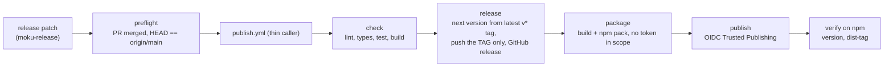

# Release model for moku packages

How releases work, why they are built this way, and the traps already paid for. The workflow logic
itself lives in one place, the `moku-labs/ci` repository. Projects carry two thin caller files (see
`node_modules/@moku-labs/ci/examples/` in a project that installed it). Read this file when a release misbehaves or when the model itself is in question;
for day-to-day releases the three commands in `SKILL.md` are enough.

## The model in one picture

- **Tag-only.** `main` is PR-only, so the release never writes `refs/heads/main`. The next version is
  derived from the latest `v*` tag. `package.json` `version` on `main` is informational and drifts
  behind the tags by design.
- **Tokenless.** npm Trusted Publishing over OIDC. There is no `NPM_TOKEN` anywhere; a token-based
  publish is less secure and cannot attach provenance.
- **Split jobs.** `package` builds and packs without `id-token`; `publish` has `id-token: write` and
  runs only `npm publish`, so dependency install scripts never see the OIDC token.
- **Prereleases** (a `-` in the version) go to the `next` dist-tag and are flagged as prerelease on
  GitHub, so an rc never becomes `latest`.

## Trusted Publishing and the reusable workflow

npm validates the **calling** workflow's filename (npm docs, "Trusted publishers": with
`workflow_call`, "validation checks the calling workflow's name"). The caller is the project's
`publish.yml`, so that filename is what `release:setup` registers with `npm trust github`. Renaming
`publish.yml` breaks publishing.

This is proven: `@moku-labs/ci` releases itself through these workflows, tokenless and with
provenance (first live release `1.1.1`). If a publish is rejected with an OIDC identity mismatch, switch the project
to `examples/package/publish.local-publish.yml` from the `@moku-labs/ci` package: the central workflow still does check, release and
package, and a short local `publish` job runs `npm publish` from the project's own file.

## Rules the central workflows follow

1. Every action is pinned to a 40-character commit SHA with a version comment. Resolve a SHA with
   `gh api repos/<owner>/<repo>/commits/<tag> --jq .sha`; use Node-24-capable action versions.
2. Least privilege: `contents: read` at the top, `contents: write` only on the release job,
   `id-token: write` only on the publish job, `persist-credentials: false` on checkouts that do not push.
   A called workflow cannot exceed what the caller grants, which is why the thin `publish.yml` grants both.
3. No untrusted data inside `run:`. Inputs, tag names and refs pass through `env:`.
4. Release notes are GitHub-native (`gh release create --generate-notes --verify-tag`), with the
   previous tag passed explicitly via `--notes-start-tag`, because tag-only bump commits are not
   ancestors of each other and auto-detection would list the full history every time.
5. A release created with the default `GITHUB_TOKEN` does not re-fire `release: published`, so the
   dispatch path publishes inline in the same run. No double publish.
6. The ref is verified against `package.json` before publishing, failing closed on a mismatch and on
   an empty ref.
7. The npm bundled with Node 24 is used as is and its floor (11.5.1) is asserted. `npm` is never
   upgraded globally next to the publish credentials.

## What `release:setup` automates

The former six manual steps, in order, each skipped when already done: check `gh` and npm logins
(the two human-only steps), write the thin workflows, bring `package.json` to the contract, first
publish (Trusted Publishing cannot be configured for a package that does not exist yet, so the first
publish is an ordinary authenticated `npm publish` without provenance), tag that version (without the
tag the workflow would start from `0.0.0`), register the trusted publisher with `npm trust github`,
apply the branch ruleset, run `release:doctor`.

## What `release <type>` automates

The dispatch discipline. The workflow releases whatever `origin/main` points at when it runs, not the
local tree. Dispatching before the PR merged publishes the old code under a new version. So the
command refuses unless the tree is clean and `HEAD == origin/main`, then dispatches, watches the run,
and checks the published version and dist-tag on npm. If wrong code was published anyway: ship the
corrected version and `npm deprecate <pkg>@<bad> "accidental publish, use <good>+"`.

## Branch ruleset

`release:setup` applies `rulesets/main.json` from the `@moku-labs/ci` package through `gh api`. It makes `main` PR-only for
everyone, admins included, and requires the four checks. Tags are not restricted, which is what lets
the tag-only release work on a protected branch.

Required check names carry the caller's job id as a prefix, because GitHub names a reusable
workflow's jobs `<caller job> / <job>`. With the thin `ci.yml` (job id `ci`) they are `ci / lint`,
`ci / types`, `ci / test`, `ci / build`. A project that renames the job in `ci.yml` has to rename
the contexts in its ruleset too, or every PR waits forever on checks that never report.

## Gotchas

- **PR head can lag the branch.** After pushing a follow-up commit to an open PR, confirm
  `gh pr view <n> --json headRefOid` caught up BEFORE merging — a merge at the stale head
  silently drops the new commit.
- **Publish dispatched before the merge landed → ships OLD code.** The workflow releases from
  `origin/main` at run time. Dispatching before your PR is merged (main is PR-only) publishes
  a new version of the prior code, which can briefly become `latest`. Always confirm PR
  **merged** + `HEAD == origin/main` first, then verify the published tarball's contents
  (rule 9 / §"Release-dispatch discipline").
- **Concurrency reuse / parent-child deadlock.** the central package-ci.yml keeps a `github.workflow`-scoped
  group so a push-to-main CI run (`CI-<ref>`) can't cancel a release's reused checks
  (`Release-<ref>`). But publish.yml MUST use a DIFFERENT literal group (`publish-<ref>`): if
  it also used `github.workflow` it would be `Release-<ref>` — the SAME group its reused
  `check` computes (github.workflow = the caller) — so the parent holds the slot while the
  child waits → deadlock, and the reusable workflow never starts.
- **Tag-only release vs. package.json.** On a protected branch package.json `version`
  drifts behind the tags; always derive the next version from the latest tag, and treat
  package.json `version` on main as informational.
- **Cumulative release notes.** Each version tag sits on a separate bump commit that is NOT
  an ancestor of the next, so `gh release create --generate-notes` can't auto-detect the
  previous tag and lists the FULL history (every release repeats all prior PRs). Pass the
  previous tag explicitly via `--notes-start-tag` (the `prev_tag` step output) for a correct
  delta. Flag prerelease tags `--prerelease` so an rc isn't surfaced as the repo's "Latest".

