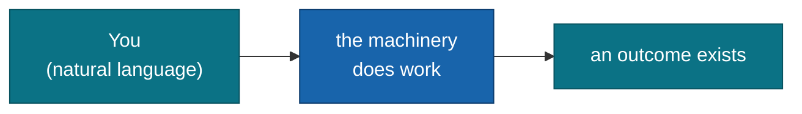

# Moku README — the main/root README house style

The standard for **root/main READMEs** across the moku-labs family. A reader landing
on the repo should, in the first screen, know **what it is, what it is *not*, how to
install it, and where the one table that matters lives** — then be able to scan tables
and copy-paste code for everything else.

Authoritative exemplars (read them when in doubt — they are the source of truth this
skill distills):

- [github.com/moku-labs/common](https://github.com/moku-labs/common) — **library / catalog** shape
- [github.com/moku-labs/web](https://github.com/moku-labs/web) — **framework** shape
- [github.com/moku-labs/claude](https://github.com/moku-labs/claude) — **toolkit / Claude Code plugin** shape

Scope: this is the **root** README only. Per-plugin READMEs are deliberately minimal
(name + tier + purpose) — see `build-final.md` Step 5.5. Companion LLM docs (`llms.txt`,
`llms-full.txt`) are a separate deliverable — see `build-final.md` Step 5.6.

---

## 1. The masthead

Every moku-labs README opens with the same five-part masthead, in this exact order:

```markdown
# <name>

**<one-line value proposition.>**

<2–4 sentence elaborating paragraph that says what it is AND what it is not.>

<br/>

[](https://www.npmjs.com/package/<pkg>)
[](#requirements)
[](#requirements)
[](./LICENSE)

<br/>

[Install](#install) · [<Central table>](#anchor) · [Usage](#usage) · [Scripts](#scripts)

---
```

Anatomy:

1. **H1** — the package or product name verbatim (`@moku-labs/common`, `@moku-labs/web`,
   `moku — Claude Code Plugin`). Not a marketing title.
2. **Tagline** — ONE **bold** (libraries) or *italic* (toolkit) sentence stating the value
   proposition. This is the hook; make it land. The toolkit may add a second witty line.
3. **Elaborating paragraph** — 2–4 sentences. Always include a *what-it-is-not* clause
   ("No framework of its own, no lock-in.", "a catalog, not a framework").
4. **Badge row** — 4–7 shields.io badges (see §5). Separate from the header with `<br/>`.
5. **Nav line** — dot-separated (` · `) anchor links to the major sections, in document
   order. Every link in the nav must resolve to a real `##` heading.
6. **`---`** horizontal rule closes the masthead. The body starts after it.

---

## 2. The body — section menu by repo shape

Pick the ordered menu for the repo's shape. Required sections are marked **(req)**.

**Library / catalog** (like `common`):
`Install` **(req)** → `Why @moku-labs/<x>` **(req)** → `<Catalog>` table **(req)** →
`Usage` **(req)** → `Entry points` table → `Scripts` **(req)** → `Requirements` **(req)** →
`License` **(req)**

**Framework** (like `web`):
`Why @moku-labs/<x>` **(req)** → `Quick start` **(req)** → `How it works` (mermaid) →
`<the contract>` → `Plugins` table **(req)** → `Rendering modes` table → `Scripts` **(req)** →
`Requirements` **(req)** → `Docs` → `License` **(req)**

**Toolkit / Claude Code plugin** (like `claude`):
`What this is` **(req)** → `Install` **(req)** → `The workflow` (mermaid + numbered steps) →
`Commands` / `Agents` / `Skills` / `Hooks` / `Workflows` tables **(req)** →
`Output styles` → `Configuration` → `License` **(req)**

**Consumer app** (Layer-3, built by `/moku:build app`):
`What it is` **(req)** → `Quick start` (the *exact* documented run command) **(req)** →
`Features` → `Configuration` → `Deployment` → `License`

Common rules across all shapes:

- **The opener** is either `What this is` (a tight paragraph) or `Why @moku-labs/<x>`
  (a bulleted "why" list — see §4). Lead, don't bury.
- **The central table** (`Catalog` / `Plugins` / `Commands`) is the heart of the doc and
  is **required**. See §8.
- **Install / Quick start** carries a status callout (see §7) and a copy-pasteable
  `bun add` / `bun install` block.
- **Scripts**, **Requirements**, **License** are boilerplate-but-required for libraries
  and frameworks — see `references/template.md` for the canonical text.

---

## 3. Voice & tone

- **Technical but conversational.** Explain the *why*, not just the *what*
  ("no second code path to keep in sync", "framework-agnostic by construction").
- **Bold lead-ins** on "why" bullets: a bold claim, then the explanation.
- **Compressed aphorisms** — one line that states a principle and stops:
  "Write once, reuse everywhere." · "The route IS the contract." ·
  "parity is structural, not duplicated."
- **Define by negation.** Say what it is *not* as well as what it is.
- **Em-dashes** for asides; they set the family's rhythm.
- **Dry wit is allowed** and the toolkit (`claude`) leans into it (self-aware jokes
  about its own validators). Libraries (`common`, `web`) stay drier but still have punch.
  Never sacrifice clarity for the joke.
- **No filler marketing.** No "blazing fast", no "powerful", no "simply". Earn every claim.

---

## 4. The "why" bullet pattern

The opener for libraries/frameworks is a bulleted list where each item leads with a
**bold claim** and then justifies it:

```markdown
## Why @moku-labs/<x>

- **Write once, reuse everywhere.** Cross-cutting plugins live here instead of being
  copy-pasted into every Moku framework.
- **A catalog, not a framework.** No `createApp`, no defaults of its own — you import
  plugin objects and register them in *your* framework's `createCoreConfig`.
- **<bold claim>.** <one sentence of justification.>
```

4–6 bullets. The first bullet is the headline benefit; at least one bullet defines by
negation.

---

## 5. Badge palette & recipes

shields.io badges with explicit brand hex colors and `logo=`. The observed family palette:

| Badge | Recipe |
|---|---|
| npm version | `https://img.shields.io/npm/v/<pkg>?logo=npm&color=cb3837&label=npm` |
| types included | `https://img.shields.io/badge/types-included-3178c6?logo=typescript&logoColor=white` |
| node ≥ 24 | `https://img.shields.io/badge/node-%3E%3D24-339933?logo=node.js&logoColor=white` |
| license MIT | `https://img.shields.io/badge/license-MIT-blue` |
| CI / build | GitHub Actions workflow badge (`/actions/workflows/<file>/badge.svg`) |
| version (non-npm) | `https://img.shields.io/badge/version-<v>-1864ab` (moku blue) |
| Claude Code plugin | `https://img.shields.io/badge/Claude%20Code-plugin-d97757` (claude orange) |
| "for @moku-labs/core" | `https://img.shields.io/badge/for-%40moku--labs%2Fcore-0b7285` (teal) |
| bundle size / budget | `https://img.shields.io/badge/<entry>-node--free-2da44e` etc. |

Brand hex reference: moku blue `1864ab` · teal `0b7285` · claude orange `d97757` ·
npm red `cb3837` · TypeScript `3178c6` · node green `339933` / accent green `2da44e`.

Rules: link each badge to a relevant in-page anchor (`#requirements`, `#entry-points`)
or external URL — never a dead badge. Keep the row to 4–7. Order: version/npm first,
license last.

---

## 6. Mermaid diagrams

Frameworks and toolkits use a `flowchart LR` in `How it works` / `The workflow`,
color-coded with the family palette so "you/your input/the outcome" reads teal and
"the machinery" reads moku-blue:

```markdown

```

Use `<br/>` for line breaks in node labels. Color-code by *role* (input/outcome vs.
machinery, or by architecture layer), not decoratively. Keep it to one screen.

---

## 7. GitHub callouts

- `> [!NOTE]` — **status / caveats.** Every Install/Quick-start carries one stating the
  semver stage: `**Status: 0.x — early.**` for pre-1.0, `**1.x, semver-compliant.**` once
  stable. Also for peer-dependency notes.
- `> [!IMPORTANT]` — **gotchas the reader will hit** (exact install command, a name that
  changed, a non-obvious requirement).
- `> [!TIP]` — **advanced usage** the reader doesn't need on day one.

---

## 8. Tables are the workhorse

Information density lives in tables, not prose. The central table is required and links
out for detail:

- **Library:** `| Export | Kind | Responsibility |` — link the export name to its source/README.
- **Framework:** `| <Plugin> | <Kind> | <Responsibility> |` — link plugin names to their docs.
- **Toolkit:** `| Command | What it does |`, plus `Agents` / `Skills` / `Hooks` grouped tables.
- **Secondary tables** (`Entry points`, `Rendering modes`) follow the same discipline.

Keep cells to one line where possible; put the *why* in the Responsibility column.

---

## 9. The footer

The license section is one line, verbatim shape:

```markdown
## License

[MIT](./LICENSE) © [moku-labs](https://github.com/moku-labs)
```

An attribution flourish is allowed (the toolkit credits its author + "reviewed by twenty
agents"). Keep the `[MIT](./LICENSE) © [moku-labs](...)` core intact.

---

## 10. Authoring checklist

Before calling a root README done:

- [ ] H1 is the real package/product name; tagline is one bold/italic value-prop line.
- [ ] Elaborating paragraph includes a *what-it-is-not* clause.
- [ ] 4–7 badges, brand-colored, each linking somewhere live; version first, license last.
- [ ] Nav line is dot-separated and every anchor resolves to a real `##` heading.
- [ ] `---` closes the masthead.
- [ ] Opener is a "why" list or a tight "what this is" paragraph — the benefit leads.
- [ ] Install/Quick start has a status `[!NOTE]` and a copy-pasteable `bun` block.
- [ ] The central table exists and links out for detail.
- [ ] Frameworks/toolkits have one on-palette mermaid `flowchart LR`.
- [ ] `Scripts` mirrors `package.json` (libraries/frameworks); `Requirements` lists
      Node ≥ 24 · Bun ≥ 1.3.14 · TS strict + the related-package link.
- [ ] Footer is the canonical `[MIT](./LICENSE) © [moku-labs](...)` line.
- [ ] Every command, script, import path, and function name referenced exists in source
      (grep-verify — this is also enforced by `build-final.md` Step 5.7).
- [ ] `bun run format` run to normalize.

See `references/template.md` for a copy-paste annotated skeleton and
`references/exemplars.md` for the three live shapes side by side.
